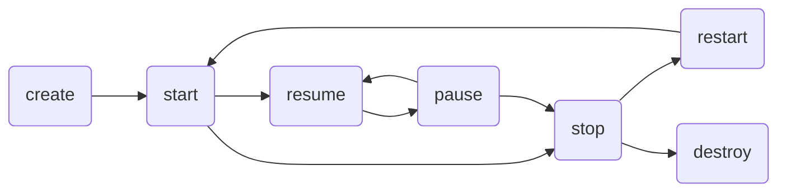

Activity 是负责显示控件的窗口，其通常以全屏窗口的形式显示，但也可作为浮动窗口、或嵌入其他窗口中。

### 生命周期

系统使用栈管理所有 Activity。当新的 Activity 启动时，被放置到栈顶并成为正在运行的 Activity。

###### 状态

Activity 在整个生命周期存在四种状态：

* **running**。位于栈顶，且通常与用户正在交互。
* **visible**。失去焦点，但依然能呈现界面给用户。
* **stopped**。对用户不可见，但仍保留所有状态和成员信息。当需要内存时，可能会被系统销毁。
* **destroyed**。已经被销毁。

###### 回调

Activity 定义了7个回调函数，覆盖其生命周期的每个部分：

* `onCreate()`，活动首次创建，提供包含先前冻结状态（如果有）的 `Bundle` 对象。
* `onStart()`，活动对用户可见。
* `onResume()`，活动与用户开始交互。
* `onPause()`，活动失去前台状态、不再可聚焦，但对用户可见。方法返回前不会恢复下一个活动。
* `onStop()`，活动对用户不可见。
* `onRestart()`，活动即将重新对用户可见。
* `onDestroy()`，活动销毁。

状态转移：

###### 保存数据

活动被销毁前，会调用 `onSaveInstanceState()`，其会提供 `Bundle` 对象，用于存放当前必要的信息，并在此 Activity 重新创建时传递该 `Bundle` 对象。
