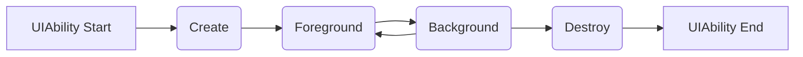

`UIAbility` 组件是系统调度的基本单元，为应用提供绘制界面的窗口；一个 `UIAbility` 组件中可以通过多个页面来实现一个功能模块。每一个 `UIAbility` 组件实例，都对应于一个最近任务列表中的任务。

每个 `UIAbility` 具有一个绑定的 `WindowStage` 对象，该对象负责实际的UI管理。

#### 声明配置
需要在 module.json5 中声明 `UIAbility` 的名称、入口、标签等相关信息后，才能正常使用，其必备属性如下：
```json
"abilities": [{   
    "name": "EntryAbility",                             // 组件类名
    "srcEntry": "./ets/entryability/EntryAbility.ts",   // 组件源码路径
    "description": "$string:EntryAbility_desc",         // 组件描述
    "icon": "$media:icon",                              // 组件图标
    "label": "$string:EntryAbility_label",              // 组件标签
    "startWindowIcon": "$media:icon",
    "startWindowBackground": "$color:start_window_background",
    ...
}]
```

#### 生命周期
`UIAbility` 的生命周期包括 Create、Foreground、Background 和 Destroy 四个状态。


###### create
应用加载过程中，`UIAbility` 实例创建完成后后，触发 `onCreate` 回调。

实例创建完成，进入 Foreground 之前，系统会创建 `WindowStage` 对象，创建完成后进入 `onWindowStageCreate()` 回调，在该回调中设置UI页面、事件订阅等。

###### foreground
`UIAbility` 实例切换至前台，UI界面可见之前触发。

###### background
`UIAbility` 实例切换至后台，UI界面完全不可见后触发。

###### destroy
`UIAbility` 实例销毁时触发，且在触发 `onDestroy` 之前，会先触发 `onWindowStageDestroy`。

#### 启动模式
启动模式是指 `UIAbility` 实例在启动时的不同呈现状态，系统提供了三种模式，通过 module.json5 的 launchType 字段设置。

###### singleton
单例模式，调用 `startAbility()` 时，如果应用进程列表中该类型的 `UIAbility` 实例已经存在，则复用系统中的该实例。即任务列表中只能存在一个该类型的 `UIAbility`。

###### multition
多实例模式，每次调用 `startAbility()` 时，都会新建一个 `UIAbility` 实例。