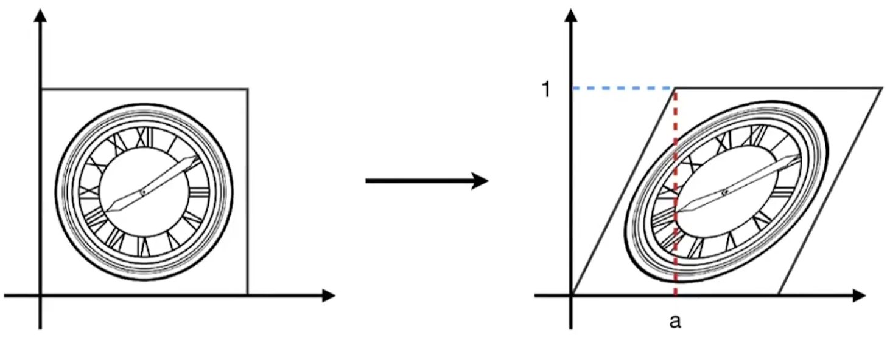

###### 错切，Shear

$$
\begin{bmatrix}
x^{'} \\
y^{'}
\end{bmatrix}

=

\begin{bmatrix}
1 \quad a \\
0 \quad 1
\end{bmatrix}

\begin{bmatrix}
x \\ y
\end{bmatrix}

=

\begin{bmatrix}
x + ay \\
y
\end{bmatrix}
$$

###### 旋转，Rotate

以(0, 0)为原点进行顺时针旋转。
$$
\begin{bmatrix}
x^{'} \\
y^{'}
\end{bmatrix}
=
\begin{bmatrix}
\cos{\theta} & -\sin{\theta} \\
\sin{\theta} & \cos{\theta}
\end{bmatrix}
\begin{bmatrix}
x\\
y
\end{bmatrix}
=
\begin{bmatrix}
\cos{\theta}x - \sin{\theta}y \\
\sin{\theta}x + \cos{\theta}y
\end{bmatrix}
$$

###### 齐次坐标

如果使用默认坐标系，无法使用矩阵表示平移变换。

使用齐次坐标，可以使用同种方式表示所有变换，但会增加空间复杂度。

对于二维点，齐次表示为$$(x, y, 1)^T$$。

对于二维向量，齐次表示为$$(x, y, 0)^T$$。

点使用1，向量使用0有以下原因：

* 0不会影响向量方向。
  * 满足以下表达式：
  * 0 + 0 = 0 --> vec + vec = vec
  * 1 - 1 = 0 --> point - point = vector 
  * 1 + 0 = 1 --> point + vec = vec

额外添加一个维度后，就可以使用矩阵表示平移变换：$$\begin{pmatrix} x^{'} \\ y^{'} \\ w^{'} \end{pmatrix}  = \begin{pmatrix} 1 & 0 & t_x \\ 0 & 1 & t_y \\ 0 & 0 & 1  \end{pmatrix} \cdot \begin{pmatrix} x \\ y \\ 1 \end{pmatrix} = \begin{pmatrix} x+t_x \\ y+t_x \\ 1  \end{pmatrix} $$。

###### 仿射变换

仿射变换：指在几何中，对向量进行线性变换+平移。

使用二维坐标系表示为：$$\begin{pmatrix} x^{'} \\ y^{'}  \end{pmatrix} =  \begin{pmatrix} a & b \\ c & d \end{pmatrix} \cdot \begin{pmatrix} x \\ y \end{pmatrix} + \begin{pmatrix} t_x \\ t_y \end{pmatrix}$$。

使用齐次二维坐标表示为：$$ \begin{pmatrix} x^{'} \\ y^{'} \\ 1 \end{pmatrix} = \begin{pmatrix} a & b & t_x \\ c & d & t_y \\ 0 & 0 & 1 \end{pmatrix} \cdot \begin{pmatrix} x \\ y \\1 \end{pmatrix}$$。

###### 逆变换

$$X \times M = X^{'}，\quad X^{'} \times M^{-1} = X$$。 

