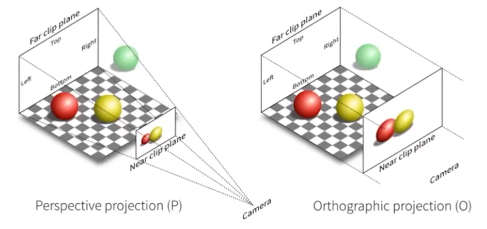

###### 齐次坐标

三维点的齐次表示为：$$\begin{pmatrix} x,y,z,1  \end{pmatrix}^T$$。

三维向量的齐次表示为：$$\begin{pmatrix} x,y,z,0  \end{pmatrix}^T$$。

三维仿射变换表示为：$$ \begin{pmatrix} x^{'} \\ y^{'} \\z^{'} \\ 1 \end{pmatrix} = \begin{pmatrix} a & b &c & t_x \\ d & e & f & t_y \\ g & h & i & t_z \\ 0 & 0 & 0 & 1 \end{pmatrix} \cdot \begin{pmatrix} x \\ y \\ z \\1 \end{pmatrix}$$。

###### 旋转变换

沿着x轴旋转：$$R_x(\alpha) = \begin{pmatrix} 1 & 0 & 0 & 0 \\ 0 & \cos{\alpha} & {-\sin{\alpha}} & 0 \\ 0 & \sin{\alpha} & \cos{\alpha} & 1 \\ 0 & 0 & 0 & 1   \end{pmatrix}$$。

沿着y轴旋转：$$R_y(\alpha) = \begin{pmatrix} \cos{\alpha} & 0 & \sin{\alpha} & 0 \\ 0 & 1 & 0 & 0\\ {-\sin{\alpha}} & 0 & \cos{\alpha} & 0 \\ 0 & 0 & 0 & 1   \end{pmatrix}$$。

沿着z轴旋转：$$R_z(\alpha) = \begin{pmatrix} \cos{\alpha} & {-\sin{\alpha}} & 0 & 0 \\ \sin{\alpha} & \cos{\alpha} & 0 & 0 \\ 0 & 0 & 1 & 0 \\ 0 & 0 & 0 & 1  \end{pmatrix}$$。

罗德里格斯公式：给定过原点的旋转轴和旋转角度，可得到其变换矩阵。
$$
R(n, \alpha) = \cos(\alpha)I + (1-\cos{\alpha})nn^T+\sin{\alpha}N
$$
其中：

* $$R(n, \alpha)$$表示绕轴$$n$$旋转$$\alpha$$角度的变换矩阵。
* $$I$$表示单位矩阵。
* $$n$$表示过原点的旋转轴。
* $$N = \begin{pmatrix} 0 & -n_z & n_y \\ n_z & 0 & {-n_x} \\ {-n_y} & n_x & 0 \end{pmatrix}$$。

###### 视图变换

视图变换是将物体从世界坐标系转换到相机坐标系的过程，也被称为相机变换。

定义一个相机，需要三个要素：

* 相机位置，记为$$\vec{e}$$。
* 相机观察方向，记为$$\hat{g}$$。
* 相机上方，记为$$\hat{t}$$。

约定俗成地，相机看向-z轴，以y轴为上方向。

变换的主要步骤：

1. 将$$\vec{e}$$平移到原点。
2. 将$$\hat{g}$$旋转到-z轴。
3. 将$$\hat{t}$$旋转到y轴。
4. 将$$\hat{g} \times \hat{t}$$旋转到x轴。

变换矩阵为$$M_{view} = R_{view} T_{view}$$。

* $$T_{view} = \begin{pmatrix} 1 & 0 & 0 & {-x_e} \\ 0 & 1 & 0 & {-y_e} \\ 0 & 0 & 1 & {-z_e} \\ 0 & 0 & 0 & 1  \end{pmatrix}$$。
* $$R_view = \begin{pmatrix} x_{\hat{g}\times{\hat{t}}} & y_{\hat{g}\times{\hat{t}}} & z_{\hat{g}\times{\hat{t}}} & 0 \\ x_t & y_t & z_t & 0 \\ x_{-g} & y_{-g} & z_{-g} & 0 \\ 0 & 0 & 0 & 1  \end{pmatrix}$$。

###### 投影

投影分为正交投影和透视投影。正交投影不会有近大远小的现象。透视投影平行线并不平行。

正交投影的步骤为：

1. 对物体进行视图变换。
2. 丢弃z轴，剩下x、y即为坐标。

