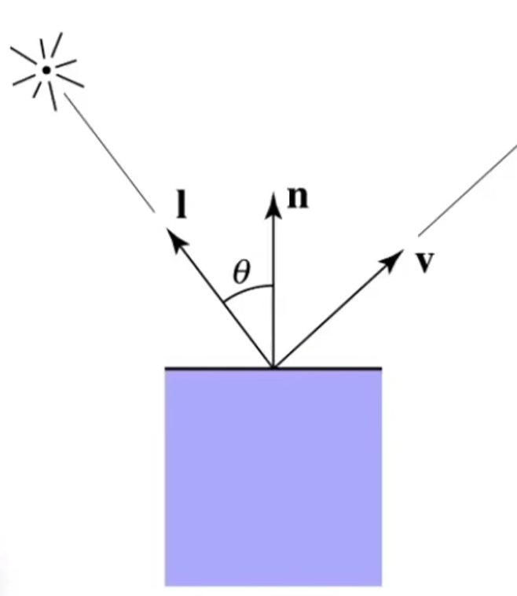
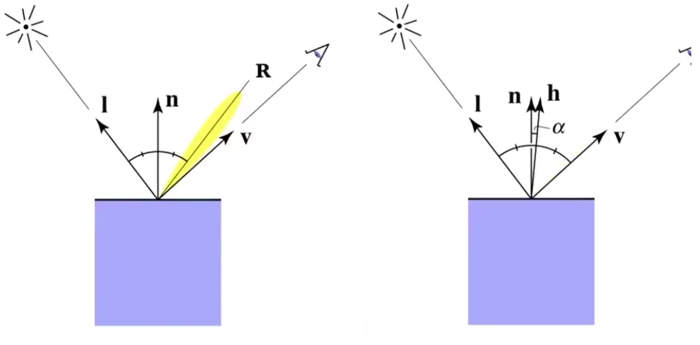
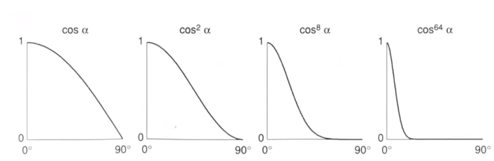

#### Blinn-Phong反射模型（Blinn-Phong Reflectance Module）

Blinn-Phong反射模型中，某个点的光照强度 = 漫反射（diffuse reflection）+ 镜面高光（specular highlight） + 环境光（ambient term）。
$$
L = K_d(I/r^2)\max(0,n\cdot l) +k_s(I/r^2)\max(0,n\cdot h)^p + k_aI_a
$$

###### 漫反射

漫反射的结果与观察方向无关。

$$
L_d = k_d(I/r^2)\max(0,n \cdot l)
$$
其中：

*   $$L_d$$表示漫反射的光照强度。

*   $$k_d$$表示漫反射系数（如果为1，所有能量都会被反射出去；如果为0，所有能量都会被吸收，该点永远是黑色）。

*   $$I$$表示光照强度。

*   $$l$$表示光源方向。

    >   使用$$\max(0,n \cdot l)$$剔除夹角大于90°的光。

###### 镜面高光

当镜面反射方向和观察方向接近时，就能看见高光。

当$$v$$和$$l$$的半程向量$$h$$和$$n$$接近，即$$\cos{\alpha} = n \cdot h$$接近1时，也就能说明反射方向$$R$$和$$v$$和接近。
$$
L_s = k_s (I/r^2)\max(0, \cos{\alpha})^p \\
\quad = k_s (I/r^2)\max(0, n \cdot h)^p
$$
其中：

*   $$h = \frac{v+l}{||v+l||}$$。

*   $$k_s$$表示镜面系数。

*   $$p$$用于决定了高光区域的大小，通常使用100~200的值。

    >

###### 环境光（ambient term）

在Blinn-Phong模型中环境光强度简化为常量。
$$
L_a = k_aI_a
$$
