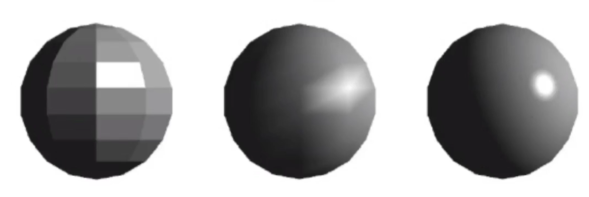

常见几种着色模型：

*   flat shading，着色整个三角形。
*   gouraud shading，着色三角形顶点，插值计算三角中的像素。
*   phong shading，着色每个像素点。

>   当物体面数较多时，使用flat shading着色模型也能得到较好的着色效果。
>
>   当物体面数过多时（面数比像素更多），使用phong shading反而计算效率更高。

###### 顶点法线

平均法线：根据顶点周围三角面法线的平均值计算。

加权法线：根据顶点周围三角面法线，和三角面的面积加权计算。

###### 像素法线

根据顶点法线，插值计算三角中所有像素的法线。