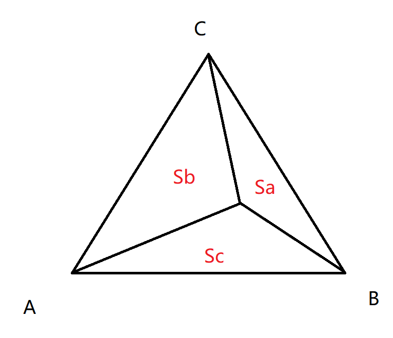

###### 重心坐标（barycentric coordinates）

三角形所在平面中任意点的坐标都可通过三角形顶点坐标的线性组合表示，即$$ (x,y) = \alpha A + \beta B + \gamma C$$，且$$\alpha + \beta + \gamma = 1$$。

当$$\alpha \ge 0$$、$$\beta \ge 0$$、$$\gamma \ge 0$$时，该点在三角形内部，且$$(\alpha, \beta, \gamma)$$即表示该点在该三角形的重心坐标。三角形的重心的重心坐标为$$(\frac{1}{3}, \frac{1}{3}, \frac{1}{3})$$。

>   还可根据面积比计算重心坐标：
>
>   
>   $$
>   \alpha = \frac{S_a}{S_a+S_b+S_c} \\
>   \beta = \frac{S_b}{S_a+S_b+S_c} \\
>   \gamma = \frac{S_c}{S_a+S_B+S_c}
>   $$
>   上述公式还可推导为：
>   $$
>   \begin{align*}
>   &\alpha = \frac{-(x-x_b)(y_c-y_b) + (y-y_b)(x_c-x_b)}{-(x_a-x_b)(y_c-y_b) + (y_a-y_b)(x_c-x_b)}\\
>   &\beta = \frac{-(x-x_c)(y_a-y_c) + (y-y_c)(x_a-x_c)}{-(x_b-x_c)(y_a-y_c) + (y_b-y_c)(x_a-x_c)}\\
>   &\gamma = 1 - \alpha - \beta
>   \end{align*}
>   $$

在进行插值时，就可以利用$$\alpha$$、$$\beta$$和$$\gamma$$对顶点进行加权计算，得到插入的值。

>   三维空间中的三角形投影到二维平面后，应该将像素坐标逆变换到三维空间坐标，再计算重心坐标。
