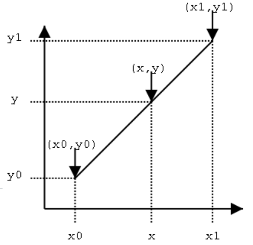
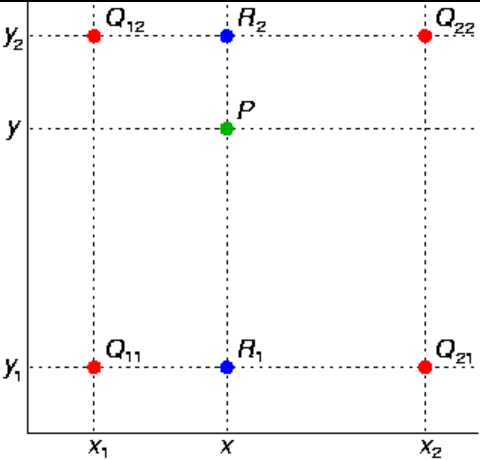
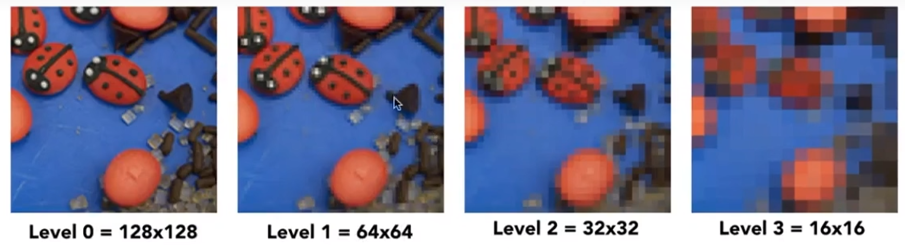
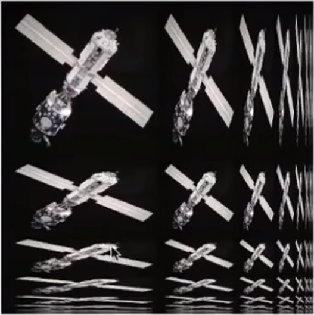

#### 放大纹理图像

当表面尺寸大于纹理图像尺寸时，需要插值计算中间像素的颜色。

###### 线性插值（linear interpolation）

已知$$f(x_0) = y_0$$，$$f(x_1) = y_1$$，$$x_0 \le x \le x_1$$，求$$f(x)$$。
$$
\begin{align*}

& \frac{y - y_0}{x - x_0} = \frac{y_1 - y}{x_1 - x} \\
& y =  \frac{x_1 - x}{x_1-x_0}y_0 + \frac{x-x_0}{x_1-x_0}y_1

\end{align*}
$$

###### 双线性插值（bilinear interpolation）

已知$$f(x_0, y_0) = Q_{00}$$，$$f(x_0, y_1) = Q_{01}$$，$$f(x_1, y_0) = Q_{10}$$，$$f(x_1, y_1) = Q_{11}$$，求$$f(x,y)$$。

首先在x方向进行线性插值：
$$
\begin{align*}

f(x, y_0) = \frac{x_1 - x}{x_1 - x_0}Q_{00} + \frac{x - x_0}{x_1 - x_0}Q_{10} \\
f(x, y_1) = \frac{x_1 - x}{x_1 - x_0}Q_{01} + \frac{x - x_0}{x_1 - x_0}Q_{11}

\end{align*}
$$
再在y方向进行插值：
$$
\begin{align*}
f(x,y) &= \frac{y_1 - y}{y_1 - y_0}f(x,y_0) + \frac{y-y_0}{y_1-y_0}f(x,y_1)\\
& = \frac{y_1 - y}{y_1 - y_0}(\frac{x_1 - x}{x_1 - x_0}Q_{00} + \frac{x - x_0}{x_1 - x_0}Q_{10}) + \frac{y-y_0}{y_1-y_0}(\frac{x_1 - x}{x_1 - x_0}Q_{01} + \frac{x - x_0}{x_1 - x_0}Q_{11})

\end{align*}
$$

>   也可先插值y方向再插值x方向。

#### 缩小纹理图像

当表面尺寸小于纹理图像尺寸时，需要进行范围计算像素的颜色。

###### mipmap

mipmap是一种快速的近似方形范围查询。mipmap根据原始图计算出不同尺寸的其他图，构成图像金字塔。mipmap的内存开销是原本的三分之一左右。

对三角形内部一点$$(u,v)_{00}$$，寻其周围两点$$(u,v)_{10}$$和$$(u,v)_{01}$$，分别映射到纹理空间中，此时$$L = \max(  \sqrt{ (\frac{d_u}{d_x})^2 + (\frac{d_v}{d_x})^2 } , \sqrt{ (\frac{d_u}{d_y})^2 + (\frac{d_v}{d_y})^2 })$$可近似为点$$(u,v)_{00}$$覆盖的近似正方形。

当获取点覆盖的近似正方形后，可根据$$Level_D = \log_2(L)$$到预先计算好的对应的mipmap图像中搜索其对应的像素值。

###### 虚拟化mipmap

mipmap计算得到的是离散层级，如果在映射时直接使用原始mipmap，映射的图像在分层等级的边界处可能会产生明显的撕裂。

假如需要在第$$D.n$$层查询像素，可以在第$$D$$层和第$$D+1$$层分别进行双线性插值计算得到像素值，然后对得到的像素值再根据$$n$$进行一次插值，就能得到虚拟化后的像素。

>   mipmap是近似计算，线性插值也是近似计算，所以通过虚拟化mimap渲染得到的结果在某些情况会过模糊。

###### 各向异性过滤（anisotropic filtering）

mipmap只会对图像进行水平和垂直方向同时缩小，而各向异性过滤还会单独对水平和垂直方向进行缩小，因此进行范围查询时就不局限于方形，而是矩形。各向异性的内存开销是原本的三倍左右。