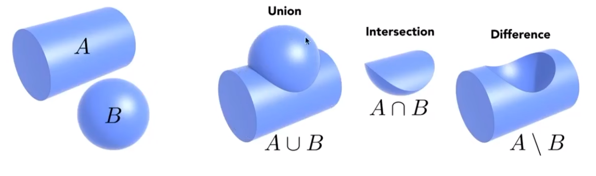
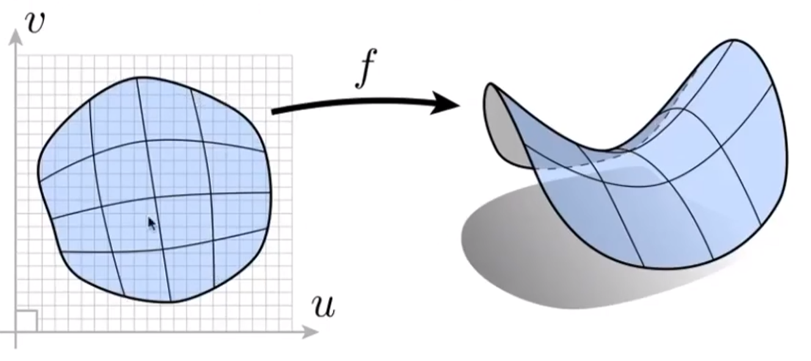

###### 隐式（implicit）表述

隐式表述难以描述几何图形的形状，但可以准确判断某个点是否在几何图形中。

隐式表述的类型有：

*   点坐标满足的某些关系，通用表达式为$$f(x,y,z) = 0$$，如表示一个单位球可以用$$x^2 + y^2 + z^2 -1 = 0$$。
*   通过基本几何构建新几何（constructive solid geometry）。
    

###### 显示（explicit）表述

显示表述便于描述几何图形的形状，但难以判断某个点是否在几何图形中。

显示表述的类型有：

*   直接给出几何图形的相关坐标。
*   给出某种映射，如$$f :  (u,v) \rightarrow(x,y,z)$$。
    

