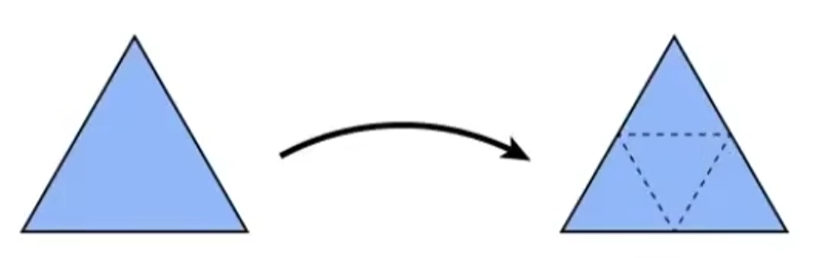
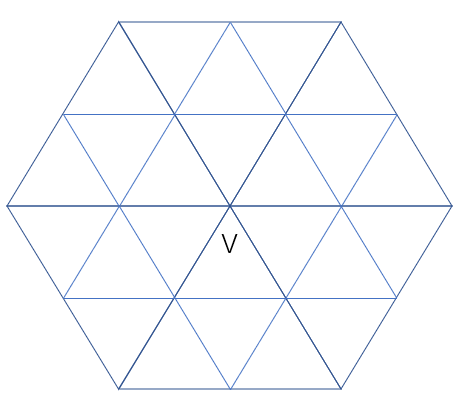
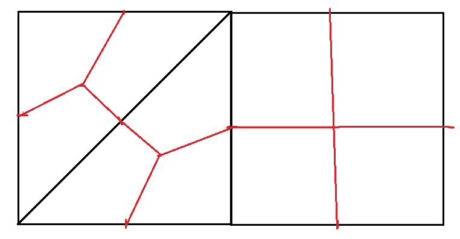

#### 细分（subdivision）

###### Loop Subdivisiaon

Loop Subdivision用于三角形细分，其步骤如下：

*   在三角形各边中心添加点将其拆分为四个三角形。

   

*   求非边界新定点的坐标：$$V = \frac{3}{8}(A+B) + \frac{1}{8}(C+D)$$。

    

*   更新分边界原始顶点坐标：$$V=(1-nu)*原始坐标+u*周围原始顶点的坐标和$$。

    其中$$n = 顶点的度（顶点连接的边的数量）$$，$$如果 n=3则u=\frac{3}{16}，否则u=\frac{3}{8n}$$。

    

###### Catmull-Clark Subdivision

Catmull-Clark Subdivision用于一般网格的细分。其步骤如下：

>   奇异点（extraordinary vertex），度不为4的点。

*   在每条边取中点，每个面取中点，连接边的中点和面的中点。

    >   原始的奇异点不会改变，非四边面的中点一定是奇异点，且引入奇异点后非四边形面都消失。

    

*   求新增顶点的坐标：

    *   对于面的中点，取面顶点的平均坐标。

    *   对于边的中点，取其连线点的平均坐标：$$v=\frac{a+b+c+d}{4}$$。

        

*   求原始顶点的坐标：$$V = \frac{f_1+f_2+f_3+f_4+2(m_1+m_2+m_3+m_4)+4p}{16}$$。

    其中$$p$$为顶点原始坐标。

    

#### 简化（simplification）

###### 边坍缩（edge collapse）

将一条边上的两个顶点移到边中点的位置，就实现了边坍缩。

通过二次误差度量（quadric error metrics）来判断需要坍缩哪些边。
