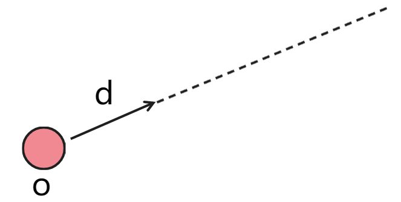
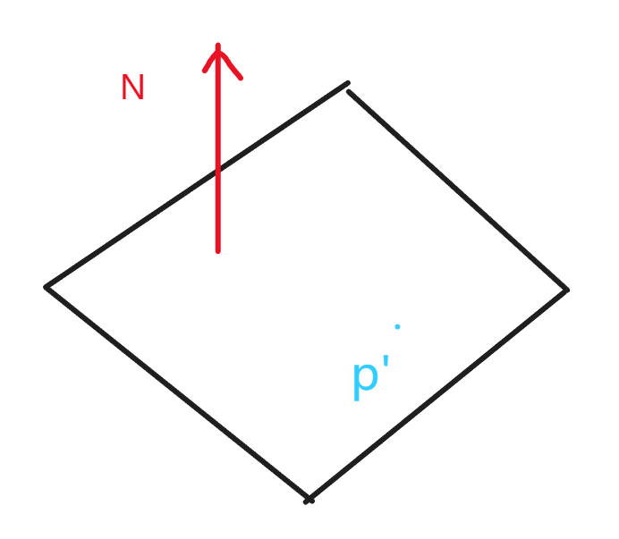
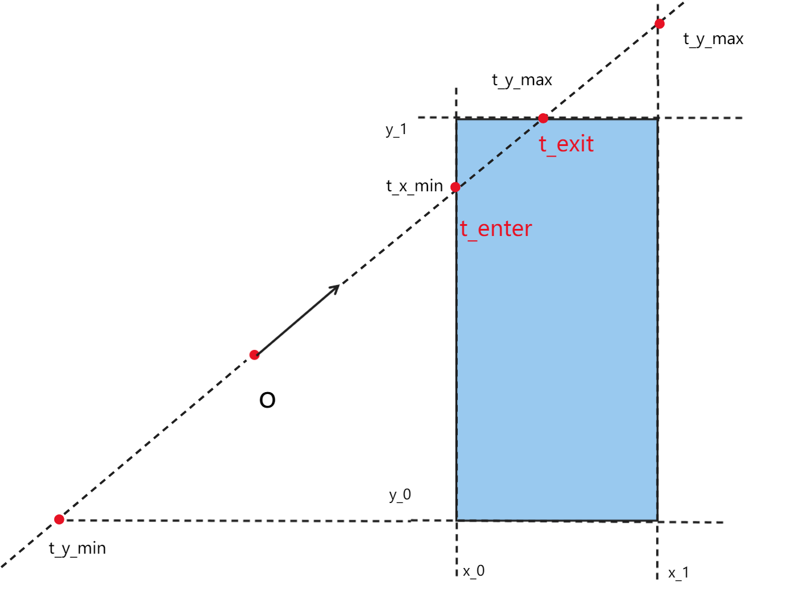

光线追踪（light ray）实现的三个前提：

*   光沿直线传播。
*   光线之间不会碰撞。
*   光线从光源出发，经过各种折射、反射最后到达呈现平面。

>   上述前提事实上并不完全正确。

###### 光源射线

对于从点光源发出的射线，其在任意时刻的坐标，都可表示为$$r(t) = o + td，t \ge 0)$$。

以某点为原点，向某一物体发出射线，如果射线与物体的交点为奇数（相切算2个点），那么该点在物体内部。

###### 光线和球的交点

在笛卡尔坐标系中，球$$c$$上的任意一点都可表示为$$(x-x_c)^2 + (y-y_c)^2 + (z-z_c)^2 = r^2$$，即对于球面上一点$$p$$，其坐标为$$p: (p-c)^2 - r^2 = 0$$。

而射线和球面的交点即可表示为$$(o+td-c)^2 - r^2=0，t \ge 0$$，可转换为二元一次函数：
$$
at^2 + bt + c = 0 \quad where\\
\begin{align*}
&a=d \cdot d \\
&b=2(o-c) \cdot d\\
&c=(o-c)\cdot(o-c)-r^2
\end{align*}
$$
可解$$t=\frac{-b \pm \sqrt{b^2-4ac}}{2a}$$，且$$t \ge 0$$。

###### 光线和三角形的交点（忽略光线和三角形平行的情况）

计算射线和三角形的交点，可以拆分为两步：

1.   计算射线和三角形所在平面的交点。

     >   
     >
     >   平面可以通过法线和一个点表示，对于平面上任意一点$$p$$，$$p:(p-p')\cdot N = 0$$，射线和平面的交点即为$$p: (o+td-p') \cdot N = 0$$，$$t=\frac{(p'-o)\cdot N}{d\cdot N}$$。

2.   判断交点是否在三角形内部。

Möller–Trumbore算法可以更快、更直接的计算射线和三角形的交点，其中心思想为：$$o+td=(1-b_1-b_2) p_0 + b_1 p_1 + b_2 p_2$$，计算矩阵为：

$$
\begin{pmatrix}
t \\
b_1\\
b_2\\
\end{pmatrix}
=
\frac{1}{\vec{S_1}\cdot \vec{E_1}}
\begin{pmatrix}
\vec{S_2}\cdot \vec{E_2} \\
\vec{S_1}\cdot {S}\\
\vec{S_2} \cdot d
\end{pmatrix}
$$

其中：
$$
\vec{E_1}=p_1-p_0\\
\vec{E_2}=p_2-p_0\\
\vec{S}=o-p_0\\
\vec{S_1}=d \times \vec{E_2}\\
\vec{S_2}=\vec{S} \times \vec{E_1}
$$
###### 光线和三角网格物体的交点

将物体的所有三角形分别和光线求交点，就可计算出光线和物体的交点，但计算效率非常低。

为了加速计算，可以使用更简单的形状（三维情况下长方体最常见）包围物体，如果光线与包围盒无交点，则光线与物体肯定也无交点。通常使用的包围盒称为轴对齐包围盒（Axis-Aligned Bounding Box），即包围盒的任何一个轴都是平行于某个轴的。

简化到二维平面的情况，AABB可使用相交于x轴和相交于y轴的四个面表示，计算光线在两对平面中的入射时间和出射时间（时间可能为负数），取两段时间的交交集，就可以得到出光线入射盒子的时间和光线出射盒子的时间，即$$t_{enter}=\max(t_{min}),t_{exit}=\min(t_{max})$$。

