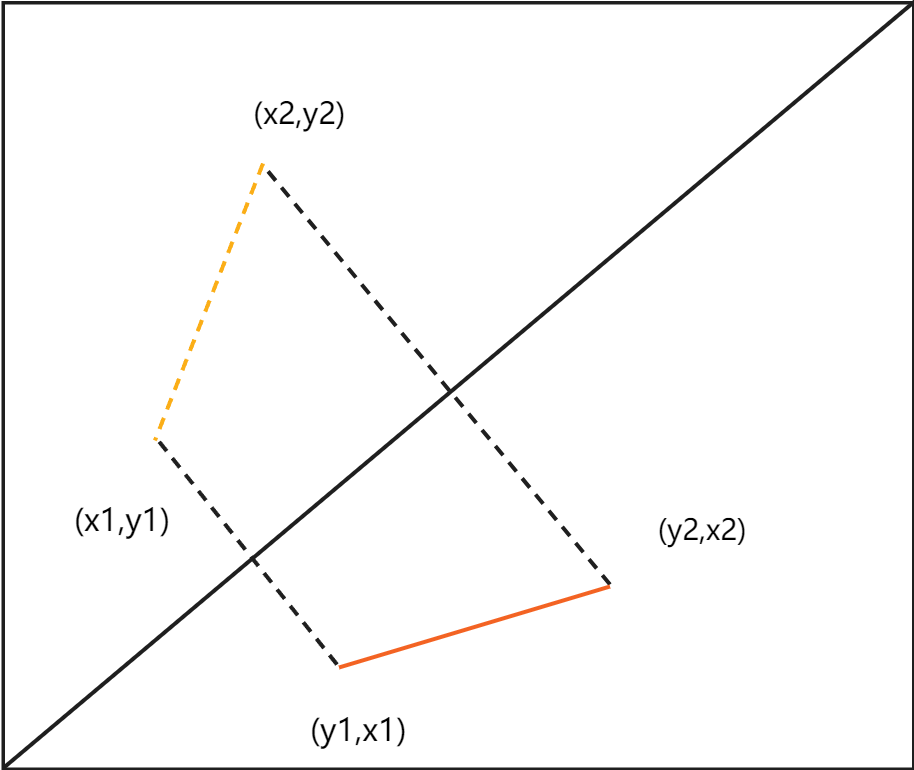
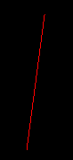

###### 版本1

最简单的直线绘制算法如下：

```cpp
void draw_line(cv::Mat dst, point_i32_t p1, point_i32_t p2, rgb_u8_t color)
{
    if (p1.x > p2.x) // 确保从p1绘制向p2
        std::swap(p1, p2);
    for (auto x = p1.x; x <= p2.x; ++x)
    {
        float t = 1.0f * (x - p1.x) / (p2.x - p1.x); // t ∈ [0,1]
        int y = p1.y * (1 - t) + p2.y * t;
        draw_point(dst, {x, y}, color);
    }
}
```

但这种算法存在缺陷：当直线过于陡峭，即当线条所处矩形的高度大于宽度时，沿着x轴移动计算y轴坐标时，因为采样次数过少，绘制出的直线在y轴上会存在空洞。


###### 版本2

为了解决这种缺陷，可以将直线进行翻转，在绘制时再翻转回去，即交换xy坐标，就可以沿着采样次数更多的y计算x。

```cpp
void draw_line(cv::Mat dst, point_i32_t p1, point_i32_t p2, rgb_u8_t color)
{
    bool steep{false}; // 是否陡峭
    if (std::abs(p1.x - p2.x) < std::abs(p1.y - p2.y))
    {
        std::swap(p1.x, p1.y);
        std::swap(p2.x, p2.y);
        steep = true;
    }
    if (p1.x > p2.x)
        std::swap(p1, p2);
    for (auto x = p1.x; x <= p2.x; ++x)
    {
        float t = 1.0f * (x - p1.x) / (p2.x - p1.x);
        int y = p1.y * (1 - t) + p2.y * t;
        if (steep)
            draw_point(dst, {y, x}, color);
        else
            draw_point(dst, {x, y}, color);
    }
}
```

这样得到的直线就不会有空洞现象了。

<div>
    
    
</div>

###### 版本3

代码中每次采样都会进行一次浮点运算，性能消耗较大。因为坐标是整数，而直线斜率是确定值，即每次采样时在y轴上的变化量也是确定值，即可以通过累计的变化量判断y轴是否增加。

```cpp
void draw_line(cv::Mat dst, point_i32_t p1, point_i32_t p2, rgb_u8_t color)
{
    bool steep{false}; // 是否陡峭
    if (std::abs(p1.x - p2.x) < std::abs(p1.y - p2.y))
    {
        std::swap(p1.x, p1.y);
        std::swap(p2.x, p2.y);
        steep = true;
    }
    if (p1.x > p2.x)
        std::swap(p1, p2);
    float slope = std::abs(1.0f * (p2.y - p1.y) / (p2.x - p1.x)); 	// 每次采样的变化量
    float accmulated_y = 0;                                   		// 累计的变化量
    int direction = (p1.y < p2.y) ? 1 : -1;                 		// 变化方向
    for (auto x = p1.x, y = p1.y; x <= p2.x; ++x)
    {
        if (steep)
            draw_point(dst, {y, x}, color);
        else
            draw_point(dst, {x, y}, color);
        accmulated_y += slope;
        if (accmulated_y > 1) // 累计变化超过1
        {
            y += direction;
            accmulated_y -= 1;
        }
    }
}
```

###### 版本4

沿用版本3的思路，最终的判别式可表示为$$\ n*\frac{p2.y-p1.y}{p2.x-p1.x} > 1$$，其中$$n$$是累计的次数。可转换为$$n*(p2.y-p1.y) > p2.x-p1.x$$，此时就不存在除法，且乘法可替换为加法，且不存在浮点运算。

```cpp
void draw_line(cv::Mat dst, point_i32_t p1, point_i32_t p2, rgb_u8_t color)
{
    bool steep{false}; // 是否陡峭
    if (std::abs(p1.x - p2.x) < std::abs(p1.y - p2.y))
    {
        std::swap(p1.x, p1.y);
        std::swap(p2.x, p2.y);
        steep = true;
    }
    if (p1.x > p2.x)
        std::swap(p1, p2);
    int delta_x = p2.x - p1.x;
    int delta_y = std::abs(p2.y - p1.y);
    int accmulated_y = 0;                   // 累计的变化量
    int direction = (p1.y < p2.y) ? 1 : -1; // 变化方向
    for (auto x = p1.x, y = p1.y; x <= p2.x; ++x)
    {
        if (steep)
            draw_point(dst, {y, x}, color);
        else
            draw_point(dst, {x, y}, color);
        accmulated_y += delta_y;
        if (accmulated_y > delta_x) // 累计变化超过1
        {
            y += direction;
            accmulated_y -= delta_x;
        }
    }
}
```


