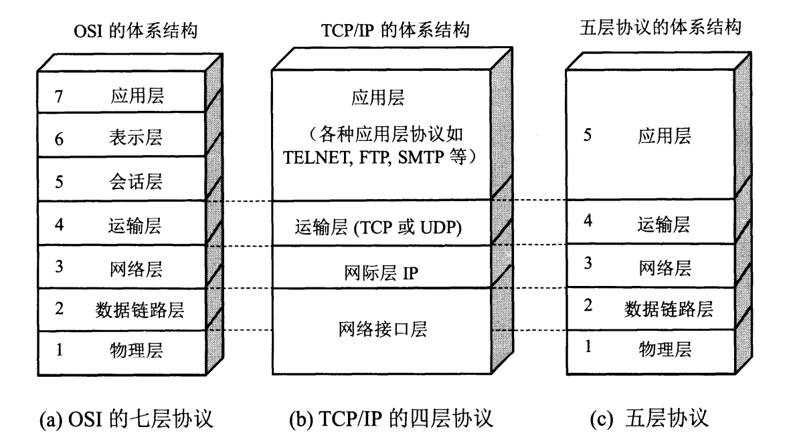

#### 时延

$$电路交换总时延 = 建立时延 + 发送时延 + 传播时延$$。

$$分组交换总时延 = 发送时延 + 传播时延 + 处理时延 + 排队时延$$：

* 『发送时延』：主机或路由器『发送』数据帧需要的时间。$$\frac{报文长度}{数据率} + 节点数 \times \frac{分组长度}{数据率} $$
* 『传播时延』：电磁波在信道『传输』需要的时间。
* 『处理时延』：主机或路由器『处理』数据帧需要的时间。
* 『排队时延』：数据在路由器的『输入队列』和『输出队列』中等待的时间（只需计算最后一个分组的排队时延）。

往返时延，RTT，Round-Trip-Time。

#### 网络模型

开放系统互联参考模型，Open-Systems-Interconnection-Reference-Model。OSI七层协议复杂且不实用，事实上的标准网络模型使用TCP/IP四层协议。

同层次间传送的数据称为『协议单元，Protocol-Data-Unit』，层与层之间传输的数据称为『服务数据单元，Service-Data-Unit』。