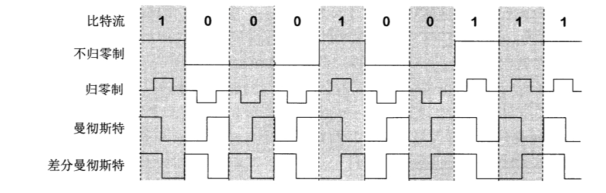
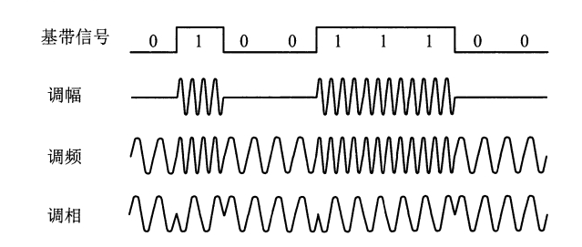

[toc]

#### 通讯系统模型

通讯系统可划分为三大部分：『源系统，或发送端』、『传输系统』和『目的系统，或接收端』。

源系统一般包含以下两部分：

* 『源点，source』，源点设备产生需要传输的数据。
* 『发送器』，通常源点生成的『数字比特流』需要经过发送器编码后才能在传输系统中传输。

目的系统一般包含以下两部分：

* 『接收器』，接受传输过来的信号，并将其转换为能被目的设备处理的信息。
* 『终点，destination』，接收从源点传输的『数字比特流』。

#### 信号

通讯的目的是传送『消息，message』，『数据，data』是运送消息的实体，『信号，signal』是数据通过『电气』或『电磁』的表现。

根据信号中代表消息的参数的取值不同，信号可分为两大类：

* 『模拟信号』，消息的取值是连续的。
* 『数字信号』，消息的取值是离散的。

『调制解调器』负责模拟信号和数字信号间的转换：

* 『调制器』将数字信号转换为模拟信号。
* 『解调器』将模拟信号转换为数字信号。

##### 数字信号常用编码

『不归零制』：正电平表示1，负电平表示0。

『归零制』：正脉冲表示1，负脉冲表示0。

『曼切斯特』：周期中心处，向上跳变表示0，向下跳变表示1。

『差分曼切实特』：周期中心处始终有跳变。对于『初始信号』，周期中心向上跳变表示0，向下跳变表示1。对于『后续信号』，开始边界处，有跳变表示0，无跳变表示1。

##### 基本带通调制方法

『调幅』：载波『振幅』随数字信号变化。

『调频』：载波『频率』随数字信号变化。

『调相』：载波『初始相位』随数字信号变化。

#### 信道复用

『频分复用，Frequency-Division-Multiplexing』，不同用户占用不同『频率』的带宽，可用于模拟信号传输。

『时分复用，Time-Division-Multiplexing』，不同用户占用不同『时间片』，常用于数字信号传输。

『统计时分复用，Statistic-TDM』，通过『集中器[^2]』连接多个用户，并将数据集中排序后发送到目标。STDM可以提高带宽利用率，又称为『异步时分复用』。

[^1]:铜线外部覆盖绝缘材料
[^2]:集中器能正常工作的前提是『用户间歇发送数据』，如果所有用户持续发送数据，集中器可能无法缓存数据，导致溢出
