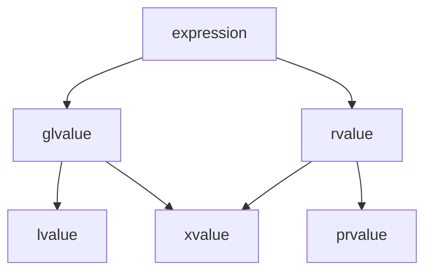

c++中的所有表达式都可以根据下图进行分类。



xvalue（eXpring value）表示资源可重用的对象。

#### 左值

以下表达式是左值表达式：

> 1. 变量、函数、模板参数对象或数据成员的名称，与类型无关（变量的类型是右值引用不影响其名称组成的表达式是左值表达式）。
>
> 2. 返回左值引用的函数调用或重载运算符表达式。
>
> 3. 内置赋值表达式、复合赋值表达式。
>
> 4. 内置前置自增自减表达式。
>
> 5. 内置解引用表达式。
>
> 6. 内置下标表达式（操作数是数组左值）。
>
> 7. `a.m`，对象成员表达式（除非m是成员枚举项或非静态成员函数，或a是右值且m是非静态数据成员）。
>
> 8. `p->m`，内置指针成员表达式（除非m是成员枚举项或非静态成员函数）。
>
>    ```cpp
>    #define is_lvalue(v) std::is_lvalue_reference_v<decltype((v))>
>
>    auto main() -> int {
>        auto p = std::make_pair(0, 0);
>        auto pp = &p;
>
>        std::cout << is_lvalue(p.first) << "\n";               // true
>        std::cout << is_lvalue(std::move(p).first) << "\n";    // false
>        std::cout << is_lvalue(std::move(pp)->first) << "\n";  // true
>
>        return 0;
>    }
>    ```
>
> 9. `a, b`，内置逗号表达式，其中b是左值。
>
> 10. `a ? b : c`，三元表达式，其中b和c都是左值。
>
>     ```cpp
>     #define is_lvalue(v) std::is_lvalue_reference_v<decltype((v))>
>     
>     auto main() -> int {
>         int i;
>         std::cout << is_lvalue(true ? i : std::move(i)) << "\n";   // false
>         std::cout << is_lvalue(false ? i : std::move(i)) << "\n";  // false
>     
>         return 0;
>     }
>     ```
>     
> 11. 字符串字面量。
>
>     ```cpp
>     #define is_lvalue(v) std::is_lvalue_reference_v<decltype((v))>
>
>     auto main() -> int {
>         std::cout << is_lvalue("hello") << "\n";  // true
>
>         return 0;
>     }
>     ```
>
> 12. 具有左值引用的非类型模板形参。
>
>     ```cpp
>     #define is_lvalue(v) std::is_lvalue_reference_v<decltype((v))>
>     
>     template <size_t& N>
>     auto call() -> void {
>         std::cout << is_lvalue(N) << "\n";
>     }
>     
>     size_t i;
>     auto main() -> int {
>         call<i>();  // true
>     
>         return 0;
>     }
>     ```
>

#### 纯右值

以下表达式是纯右值表达式：

> 1. 除了字符串字面量之外的字面量。
> 2. 返回非引用的函数调用或重载运算符表达式。
> 3. 内置后置自增自减表达式。
> 4. 内置布尔逻辑表达式。
> 5. 内置取地址表达式。
> 6. `a.m`，对象成员表达式，其中m是成员枚举项或非静态成员函数。
> 7. `p->m`，内置指针成员表达式，其中m是成员枚举项或非静态成员函数。
> 8. `a, b`，逗号表达式，其中b是右值。
> 9. `this`指针。
> 10. 枚举项。
> 11. 具有标量类型的非类型模板形参。
> 12. lambda表达式。
> 13. requires表达式。
