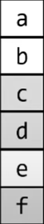
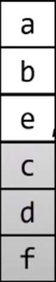
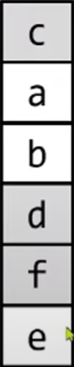
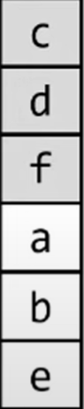

###### 非静态数据成员排布

现代c++要求具有相同访问权限的非静态数据成员在内存中的排布顺序与声明顺序一致，即声明在后面的非静态数据成员在内存中的排布也在后面。

但并没有限制具有不同访问权限的非静态数据成员的排布关系。

>   对于如下类：
>
>   ```cpp
>   class data_t {
>    public:
>      int a;
>      int b;
>   
>    private:
>      int c;
>      int d;
>   
>    public:
>      int e;
>   
>    private:
>      int f;
>   };
>   ```
>
>   如下可能的分布顺序都是合法的：
>
>   <div>
>       
>       
>       
>       
>   </div>

###### 空类型大小

空类型也需要占据内存空间，所以其大小至少为1。但如果某个类的非静态数据成员是空类型，那么其也会占据内存空间。

c++20引入属性`[[no_unique_address]]`，表示该成员可能会重叠，即如果该成员是空类型，那么编译器就可能会将其优化到其它成员的空间上。

```cpp
struct empty_1_t {};
struct empty_2_t {};
struct data_t {
    [[no_unique_address]] empty_1_t _1;
    [[no_unique_address]] empty_2_t _2;
};

int main() {
    println("{}", sizeof(data_t)); // 1

    return 0;
}
```
只能重叠到不同类型的成员上。

```cpp
struct empty_t {};
struct data_t {
    [[no_unique_address]] empty_t _1;
    [[no_unique_address]] empty_t _2;
};

int main() {
    println("{}", sizeof(data_t)); // 2

    return 0;
}
```
需要被重叠的对象应该最好成员声明的起始位置。

```cpp
struct empty_t {};
struct data_1_t {
    int val;
    [[no_unique_address]] empty_t em_1;
    [[no_unique_address]] empty_t em_2;
};
struct data_2_t {
    [[no_unique_address]] empty_t em_1;
    [[no_unique_address]] empty_t em_2;
    int val;
};

int main() {
    println("{}", sizeof(data_1_t)); // 8
    println("{}", sizeof(data_2_t)); // 4

    return 0;
}
```

>   空类型指没有非静态数据成员、没有虚函数也没有虚基类的类。如无状态的lambda就是空类型。


