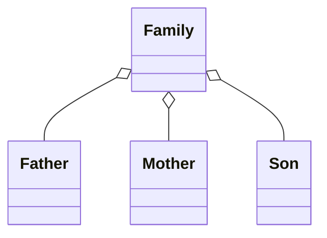
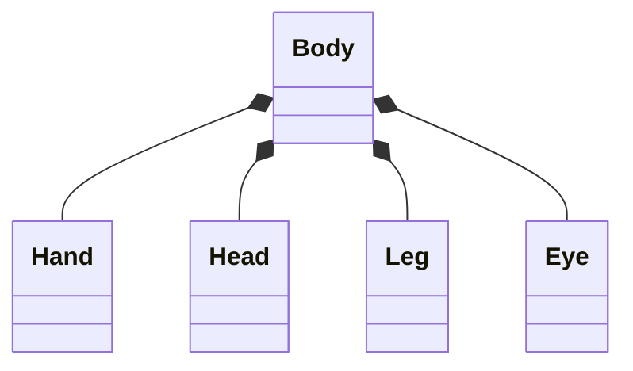
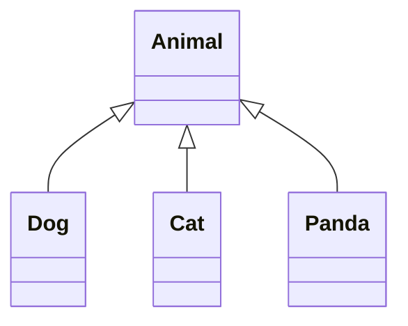

#### 类之间的关系

###### has a

聚合。一种较为松散的关系，部分和整体的生命周期未必一致。

```mermaid
classDiagram

Family o-- Father
Family o-- Mother
Family o-- Son
```

组合。一种较为紧密的关系，部分和整体的生命周期一致。

```mermaid
classDiagram

Body *-- Hand
Body *-- Head
Body *-- Leg
Body *-- Eye
```

###### is a

```mermaid
classDiagram
Animal <|-- Dog
Animal <|-- Cat
Animal <|-- Panda
```

