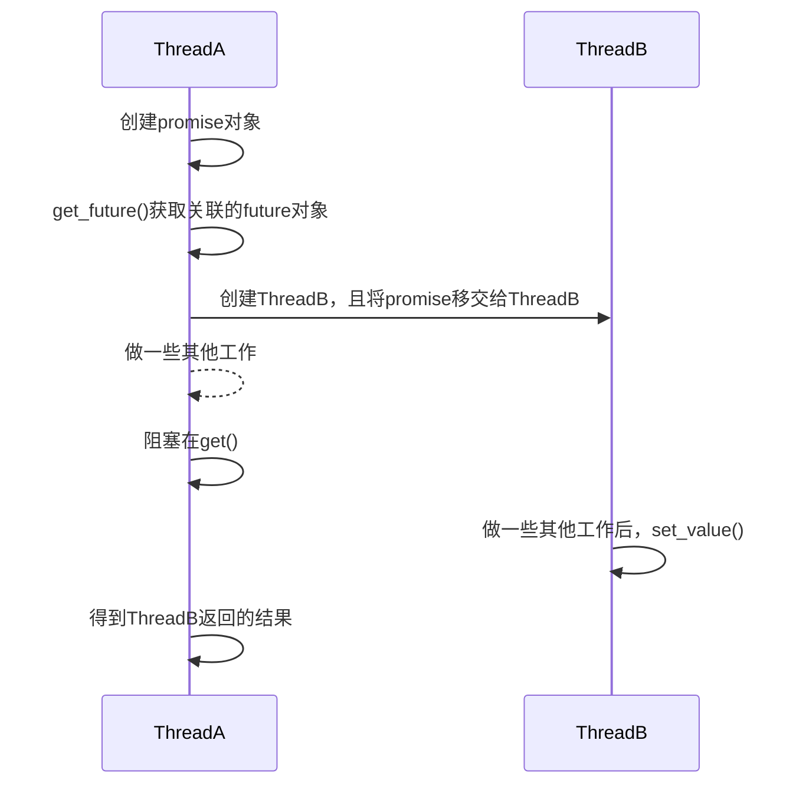

#### async

`std::async()`提供基于任务的异步调用方式，其立即返回与任务关联的`std::future`对象：

* `std::async(task, args...)`，根据程序状态自动决定任务执行策略。

* `std::async(policy, task, args...)`，手动设置策略。

  * `std::launch::async`，创建新线程立即执行任务。
  * `std::launch::deferred`，请求结果时在调用线程执行任务（惰性求值）。

  ```cpp
  auto get_thread_id_hash = [hasher = std::hash<std::thread::id>{}](){
      return hasher(std::this_thread::get_id());
  };
  auto main_thread_hash = get_thread_id_hash();
  
  auto fut_1 = std::async(std::launch::async, get_thread_id_hash);
  fmt::print("{}\n", fut_1.get() == main_thread_hash);	// false
  
  auto fut_2 = std::async(std::launch::deferred, get_thread_id_hash);
  fmt::print("{}\n", fut_2.get() == main_thread_hash);	// true
  ```

---

#### future

`std::future`存放异步任务的返回值或抛出的异常，其返回结果只能访问一次，如果需要多次访问或共享返回值，使用`std::shared_future`。

###### 结果

使用`get()`阻塞获取异步任务结果：

* 调用前，如果对象无效，行为未定义。使用`valid()`判断对象是否有效。
* 调用后，对象被设置为无效状态。
* 如果异步任务抛出异常，`get()`也抛出异常。

使用`wait()`阻塞等待任务结束。

---

#### promise

`std::promise`管理`future`对象，在适合时可以设置`future`的结果或异常。其不可拷贝、可移动，常用于线程间单次数据传输。

使用`get_future()`获取其关联的`future`对象。

使用`set_value()`或`set_exception()`设置其关联`future`对象的结果。也可使用`set_xxx_at_thread_exit()`版本，其只会在线程结束时才发送通知。


