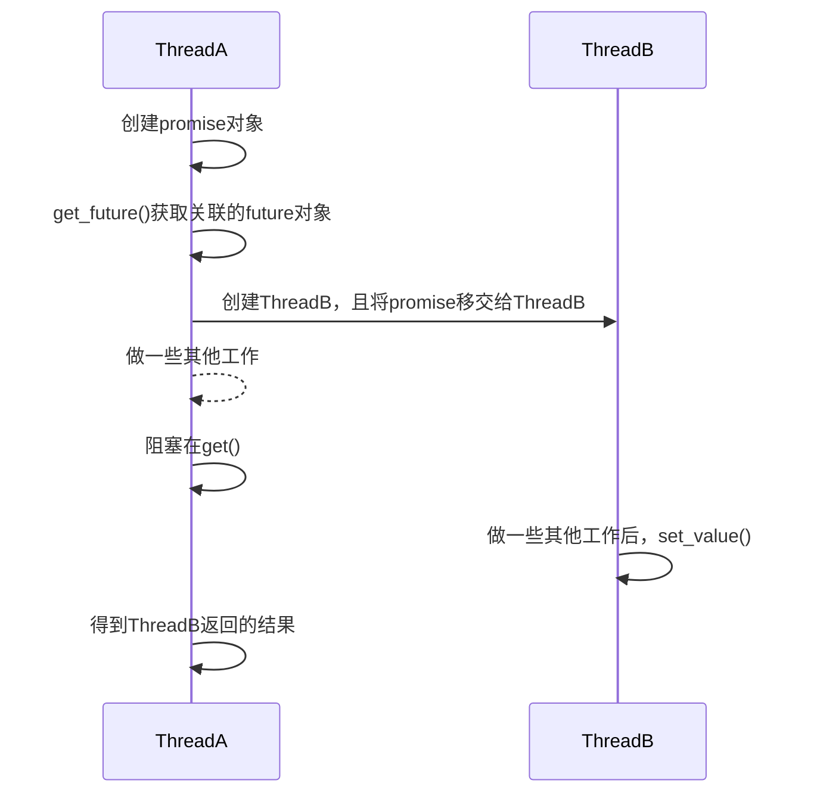

#### async

使用`std::async(callable, args)`异步执行任务，立即返回关联的`std::future`对象。

还可使用`std::async(policy, callable, args)`重载版本，接受额外的策略参数。

1. `std::launch::async`，创建新线程立即执行任务。
2. `std::launch::deferred`，请求结果是在当前线程执行任务（惰性求值）。

---

#### future

`std::future`存放异步任务的返回值或抛出的异常，其返回结果只能访问一次，如果需要多次访问或共享返回值，使用`std::shared_future`。

###### 结果

使用`get()`阻塞等待异步任务的结果。

1. 调用前，如果对象无效，行为未定义。使用`valid()`判断对象是否有效。
2. 调用后，对象被设置为无效状态。
3. 如果异步任务抛出异常，`get()`也抛出异常。

使用`wait()`、`wait_for()`和`wiat_until()`等待结果有效。

---

#### promise

`std::promise`管理`future`对象，在适合时可以设置`future`的结果或异常。其不可拷贝、可移动，常用于线程间单次数据传输。

使用`get_future()`获取其关联的`future`对象。

使用`set_value()`或`set_exception()`设置其关联`future`对象的结果。也可使用`set_xxx_at_thread_exit()`版本，其只会在线程结束时才发送通知。

