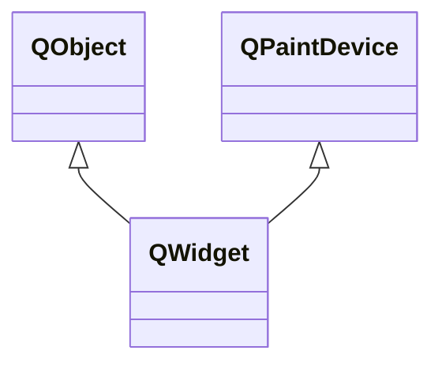

---

#### QWidget

`QWidget`是用户界面的原子部件，其既可以嵌入到其它部件中作为一个小组件，也可以作为一个拥有框架和标题栏的单独窗口。

###### 属性

| 属性                                     | 类型                    | 说明                                                         |
| ---------------------------------------- | ----------------------- | ------------------------------------------------------------ |
| accessibleDescription                    | `QString`               | 通过辅助技术可见的对小组件的描述。                           |
| accessibleName                           | `QString`               | 通过辅助技术可见的小组件名称，无障碍模式时可使用。           |
| styleSheet                               | `QString`               | QSS样式表。                                                  |
| contextMenuPolicy                        | `Qt::ContextMenuPolicy` | 显示上下文菜单的策略，默认为`Qt::DefaultContextMenu()`，即调用`contextMenuEvent()`。 |
| cursor                                   | `QCursor`               | 光标样式。                                                   |
| enabled                                  | `bool`                  | 组件是否启用。                                               |
| focus isActiveWindow                | `bool`                  | 窗口/组件是否处于焦点。                                      |
| visible                                  | `bool`                  | 窗口是否可见。                                               |
| fullScreen maximized minimized | `bool`                  | 是否全屏/最大/最小化。                                       |
| modal                                    | `bool`                  | 是否是模态窗口。                                             |
| mouseTracking                            | `bool`                  | 是否跟踪鼠标位置。                                           |
| font                                     | `QFont`                 | 组件上的字体。                                               |
| baseSize                                 | `QSize`                 | 基准尺寸，默认为(0,0)。                                      |
| maximumSize minimumSize size   | `QSize`                 | 最大/最小/当前尺寸。                                         |
| x y                                 | `int`                   | 组件相对父组件的位置。                                       |
| pos                                      | `QPoint`                | 窗口/组件的位置。                                            |
| windowOpacity                            | `double`                | 窗口透明度。                                                 |
| windowTitle                              | `QString`               | 窗口标题。                                                   |

###### 成员函数

| 函数原型                                   | 说明                                         |
| ------------------------------------------ | -------------------------------------------- |
| `void addAction(QAction* action)`          | 添加一个动作。                               |
| `void setFixedSize(int width, int height)` | 设置组件固定大小。                           |
| `void setLayout(QLayout* layout)`          | 设置组件布局管理。                           |
| `void move(const QPoint& pos)`             | 移动组件。                                   |
| `void setStyle(QStyle* style)`             | 设置GUI样式，默认为`QApplication::style()`。 |
