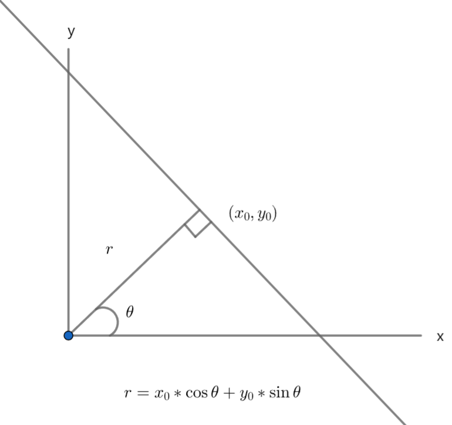

霍夫变换用于检测二值图中的基本几何图形，如直线、圆。

任意直线都可以表示为$$y = -\frac{\cos\theta}{\sin\theta}*x + \frac{r}{\sin\theta}$$

将$$r$$和$$\theta$$分成若干段，并生成二维表。将二值图中的白点像素坐标作为$$x_0$$和$$y_0$$，使用不同分段的$$\theta$$计算$$r$$，并将表中对应位置的值加一。

则最后得票数越多的$$\theta$$和$$r$$组，就越可能是图像中存在的直线。

---

#### 标准霍夫变换

使用`cv::HoughLines(img, lines, rho, theta, threshold, srn, stn, min_theta, max_theta)`使用标准霍夫变换在二值图像中查找线条。

1. `lines`，线条的输出向量，每条线由$$r$$和$$\theta$$两个元素表示，可以是`std::vector<cv::Vec2f>`。
2. `rho`，以像素为单位的距离步长。
3. `theta`，以弧度为单位的角度步长。
4. `threshold`，得票数的阈值。 
5. `srn`，可选参数，用于多尺度霍夫变换。
6. `stn`，可选参数，用于多尺度霍夫变换。
7. `min_theta`，可选参数，检查线的最小角度。
8. `max_theta`，可选参数，检查线的最大角度。

---

#### 累计概率霍夫变换

累计概率霍夫变换可以获取线条的两个端点。

使用`cv::HoughLinesP(img, lines, rho, theta, threshold, min_line_gap, max_line_gap)`使用累计概率霍夫变换。

1. `lines`，线条输出向量，每条线由x1,y1,x2,y2四个元素表示，可以是`std::vector<cv::Vec4i>`。
2. `min_line_gap`，可选参数，最小线长度。
3. `max_line_gap`，可选参数，最大线长度。

---

#### 霍夫圆变换

