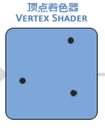
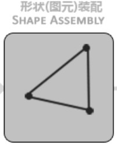
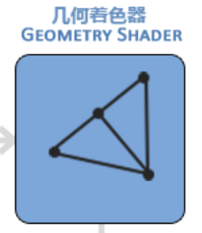
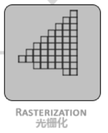
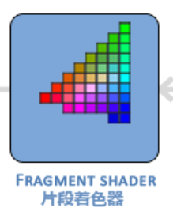
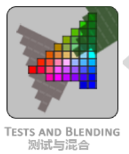

###### 状态机

OpenGL自身是一个巨大的状态机：一系列的变量描述OpenGL此刻应当如何运行。OpenGL的状态通常被称为OpenGL上下文。通常使用如下途径去更改OpenGL状态：设置选项，操作缓冲。最后，使用当前OpenGL上下文来渲染。

假设需要OpenGL去画线段而不是三角形的时候，通过改变一些上下文变量来改变OpenGL状态，从而告诉OpenGL如何去绘图。一旦改变了OpenGL的状态为绘制线段，下一个绘制命令就会画出线段而不是三角形。

使用OpenGL的时候，会遇到一些状态设置函数，这类函数将会改变上下文。以及状态使用函数，这类函数会根据当前OpenGL的状态执行一些操作。

###### 渲染管线

OpenGL中的所有事务都是在3D空间中的，OpenGL的大部分工作都是将3D坐标转换为2D像素。

> 2D坐标和2D像素并不相同，2D坐标精确表示一个点在2D空间中的位置，2D像素只是一个近似值。

3D坐标转为2D坐标的处理过程是由OpenGL的图形渲染管线（Graphics Pipeline，指原始图形数据途经输送管道，经过各种变化处理最终出现在屏幕的过程）管理的。

渲染管线可以被划分为两个主要部分：

* 第一部分将3D坐标转换为2D坐标。
* 第二部分将2D坐标转变为实际的有颜色的像素。

渲染管线主要有以下几种部件：

* 顶点数据（Vertex Data），是一系列顶点的相关数据的集合。顶点数据作为渲染管线的输入。
* 顶点着色器（Vertex Shader），将顶点转换为标准设备坐标，同时顶点着色器允许对顶点数据进行基本处理。

    

* 图元装配（Primitive Assembly），将顶点着色器输出的顶点数据进行连接，装配成指定的图元形状。

    

* 几何着色器（Geometry Shader），将图元装配输出的图元生成新的形状（大部分情况下没什么作用）。

    

* 光栅化（Rasterization），将最终图元映射到相应2D像素，生成片段（一个片段是渲染一个像素需要的所有数据）供片段着色器使用，且裁剪掉视野之外的像素。

    

* 片段着色器（Fragment Shader），计算像素的最终颜色，OpenGL所有高级效果产生的地方。

    

* Alpha测试和混合（Blending），根据遮挡关系混合图像，以及alpha值。

    

> GPU上存在数以千计的小型处理器，用于在渲染管线中快速处理数据。这些核心为管线的每一步运行一些程序，这些程序称为着色器。

