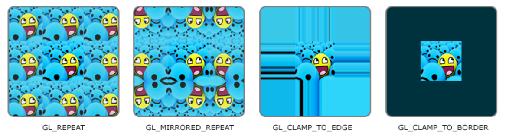

纹理（Texture），通常是2D图片（也存在3D甚至1D纹理），将纹理映射到物体上添加物体表面细节。

纹理是照片，如果需要将纹理映射到物体上，就需要将每个顶点关联到一个纹理坐标上，对其它像素进行插值处理。

使用纹理坐标获取纹理颜色叫做采样（Sampling），在2D纹理中，起始坐标为（0,0），位于图像左下角，终止坐标为（1,1），位于图像右上角。

###### 环绕方式

纹理坐标的范围为（0,0）~（1,1），但允许纹理坐标超过这个范围，OpenGL提供了多种处理纹理环绕的方式：

* `GL_REPEAT`，重复纹理图像。
* `GL_MIRRORED_REPEAT`，镜像重复纹理图像。
* `GL_CLAMP_TO_EDGE`，将坐标约束在0~1范围，超出部分会重复纹理边缘。
* `GL_CLAMP_TO_BORDER`，将坐标约束在0~1范围，超出部分指定颜色。

###### 使用

`glGenTextures(n, tex_ids)`，创建纹理对象。

`glBindTexture(target, tex_id)`，绑定纹理对象。

* target
  * `GL_TEXTURE_2D`，2D纹理。

`glTexParamterT(target, name, param)`，设置纹理参数。

* T，参数值类型，可以是i、f。
* name，

