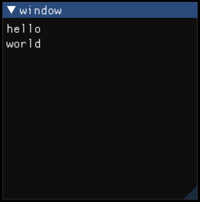

#### 窗口

使用`ImGui::Begin(name, p_open, flags)`创建新窗口，并将其压入栈中。

>   参数：
>
>   *   `p_open`，如果传入非空指针，将在窗口右上角显示一个关闭组件，当组件被点击后，指针内容会被设为`false`。
>
>   返回：返回`false`表示窗口被折叠或裁剪，此时可以提前将窗口弹出栈，以避免不必要的渲染。

使用`ImGui::End()`将窗口弹出栈。

>   无论什么情况，`Begin()`和`End()`都必须要成对出现。

PS：

1.   窗口以窗口名作为唯一标识，可以重复调用`Begin()`和`End()`在同一个窗口中添加组件。

     ```cpp
     ImGui::Begin("window");
     ImGui::Text("hello");
     ImGui::End();
     
     ImGui::Begin("window");
     ImGui::Text("world");
     ImGui::End();
     ```

     

2.   窗口堆栈底部总是名为**Debug**的窗口，如果在`Begin()`/`End()`之外创建组件，都会直接添加到**Debug**窗口中。

---

#### 子窗口

使用`ImGui::BeginChild(id, size, border, flags)`创建子窗口，并将其压入栈中。

>参数：
>
>*   `id`，窗口唯一标识，可以是无符号整数也可以是字符串。
>*   `size`，窗口尺寸。
>    *   如果等于0，自动适应父窗口。
>    *   如果大于0，固定尺寸。
>    *   如果小于0，固定尺寸，计算方式为：`父窗口剩余尺寸 - abs(size)`。
>
>返回：返回`false`表示窗口被折叠或被裁剪。
>
>说明：子窗口中也能嵌入子窗口。

使用`ImGui::EndChild()`将窗口弹出栈。

```cpp
ImGui::Begin("out window");
ImGui::PushStyleColor(ImGuiCol_ChildBg, { 0.f,0.f,1.f,1.f });
ImGui::BeginChild("childwindow", { 200,200 });
ImGui::Text("child_window");
ImGui::EndChild();
ImGui::PopStyleColor();
ImGui::End();
```


---

#### 窗口属性

###### 获取

使用`ImGui::IsWindowFocused(flags)`判断当前窗口是否处于焦点。

使用`ImGui::IsWindowHovered(flags)`判断光标是否悬停在窗口中。

使用`ImGui::GetWindowDrawList()`获取当前窗口的绘图列表，可以向其中追加绘图原语。

使用`ImGui::GetWindowSize()`获取当前窗口尺寸。

###### 修改

修改属性有三套API：`setNextWindow???(...)`设置下个窗口属性，`setWindow???(...)`设置当前窗口属性，`setWindow???(name, ...)`设置具名窗口属性。

使用`ImGui::SetWindowPos(pos, cond)`设置窗口的位置。

>   参数：
>
>   *   `cond`，设置位置的条件（默认在任何情况下都设置）。
>       *   `ImGuiCond_Once`，每个渲染帧只设置一次。
>       *   `ImGuiCond_FirstUseEver`，只在第一次创建窗口时设置。
>       *   `ImGuiCond_Appearing`，只在窗口第一次显示时设置。

使用`ImGui::SetWindowSize(size, cond)`设置窗口尺寸。

使用`ImGui::SetWindowCollapsed(collapsed, cond)`设置窗口的折叠状态。

使用`ImGui::SetWindowFocus()`设置窗口聚焦。

使用`ImGui::SetWindowFontScale(scale)`设置窗口的字体缩放。

---

#### 滚动条

使用`ImGui::GetScrollX()`、`ImGui::GetScrollY()`、`ImGui::GetScrollMaxX()`、`ImGui::GetScrollMaxY()`获取滚动条当前位置和最大位置。

使用`ImGui::SetScrollX(x)`、`ImGui::SetScrollY(y)`设置滚动条当前位置。

>   说明：对滚动条的改变会在下一帧进行，可以使用`ImGui::SetNextWindowScroll(scroll)`避免这种延迟。