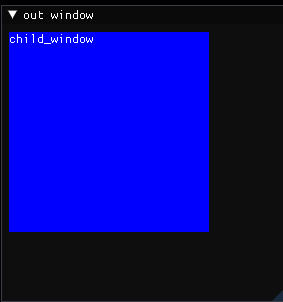

使用`ImGui::BeginChild(id, size, border, flags)`创建子窗口，并将其压入栈中。

>参数：
>
>*   `id`，窗口唯一标识，可以是无符号整数也可以是字符串。
>*   `size`，窗口尺寸。
>    *   如果等于0，自动适应父窗口。
>    *   如果大于0，固定尺寸。
>    *   如果小于0，固定尺寸，计算方式为：`父窗口剩余尺寸 - abs(size)`。
>
>返回：返回`false`表示窗口被折叠或被裁剪。
>
>说明：子窗口中也能嵌入子窗口。

使用`ImGui::EndChild()`将窗口弹出栈。

```cpp
ImGui::Begin("out window");
ImGui::PushStyleColor(ImGuiCol_ChildBg, { 0.f,0.f,1.f,1.f });
ImGui::BeginChild("childwindow", { 200,200 });
ImGui::Text("child_window");
ImGui::EndChild();
ImGui::PopStyleColor();
ImGui::End();
```

