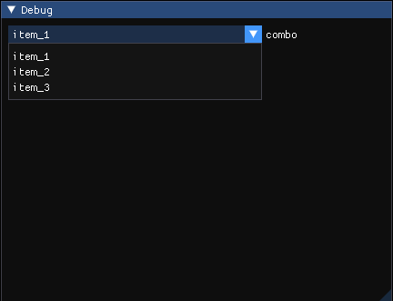

`ImGui::BeginCombo(label, preview_value, flags)`，下拉框。

>   **参数：**
>
>   *   `preview_value`，默认显示值。
>
>   ---
>
>   **返回：**返回`true`时，表示下拉框被选中，此时需要调用`ImGui::EndCombo()`。
>
>   ---
>
>   **示例：**
>
>   ```cpp
>   static const char* items[] = { "item_1", "item_2", "item_3" };
>   static int select_item = 0;
>   if (ImGui::BeginCombo("combo", items[select_item])) {
>       for (int i = 0; i < sizeof(items) / sizeof(char*); ++i) {
>           if (ImGui::Selectable(items[i])) {
>               select_item = i;
>           }
>       }
>       ImGui::EndCombo();
>   }
>   ```
>
>   

