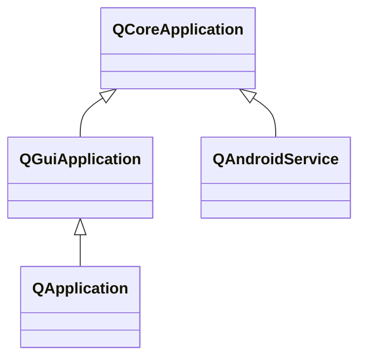

---

#### QCoreApplication

`QCoreApplication`负责处理QT非GUI应用程序的事件循环，所有QT程序必须且只能包含一个`QCoreApplication`或其派生类对象。

`QGuiApplication`负责QGUI应用程序，`QApplication`负责QWidget应用程序。

###### 属性

| 属性               | 类型      | 说明           |
| ------------------ | --------- | -------------- |
| applicationName    | `QString` | 应用程序名。   |
| applicationVersion | `QString` | 应用程序版本。 |

###### 成员函数

| 函数原型                                                     | 说明                                                       |
| ------------------------------------------------------------ | ---------------------------------------------------------- |
| `virtual bool notify(QObject *receiver, QEvent *event)`      | 任意事件触发时调用。                                       |
| `void installNativeEventFilter(QAbstractNativeEventFilter *filterObj)` `void removeNativeEventFilter(QAbstractNativeEventFilter *filterObject)` | 安装或移除本地事件过滤器。 只有最后安装的过滤器有效。 |
| `void quit()`                                                | 请求结束，触发`QEvent::Quit`，可能被忽略。                 |
| `void exit(int ret_code = 0)`                                | 要求结束，不能忽略。                                       |

###### 静态函数

| 函数原型                                                     | 说明                                                         |
| ------------------------------------------------------------ | ------------------------------------------------------------ |
| `int exec()`                                                 | 开始事件循环。                                               |
| `qint64 applicationPid()`                                    | 当前进程ID。                                                 |
| `QString applicationDirPath()` `QString applicationFilePath()` | 可执行程序所在目录。 可执行程序文件路径。               |
| `QCoreApplication* instance()`                               | 获取指向构造实例对象的指针。                                 |
| `void postEvent(QObject *receiver, QEvent *event, int priority = Qt::NormalEventPriority)` | 向事件队列中加入事件。 事件必须分配在堆中，且由事件队列释放。 |
| `bool sendEvent(QObject *receiver, QEvent *event)`           | 通过`notify()`，直接将事件传递给接受者。事件可以直接分配在栈中。 |

###### 常用信号

| 信号原型             | 说明                         |
| -------------------- | ---------------------------- |
| `void aboutToQuit()` | 程序即将退出事件循环时触发。 |

---

#### QGuiApplication

###### 属性

| 属性                                   | 类型                   | 说明                                           |
| -------------------------------------- | ---------------------- | ---------------------------------------------- |
| primaryScreen                          | `QScreen*`             | 当前程序所在屏幕。                             |
| quitOnLastWindowClosed                 | `bool`                 | 最后一个窗口关闭时，是否结束程序。默认`true`。 |
| applicationDisplayName windowIcon | `QString` `QIcon` | 默认窗口名和窗口图标。                         |

###### 成员函数

| 函数原型                                          | 说明                   |
| ------------------------------------------------- | ---------------------- |
| `double devicePixelRatio()`                       | 程序所在屏幕缩放率。   |
| `QString sessionId()` `QString sessionKey()` | 当前会话标识符和密匙。 |

###### 静态函数

| 函数原型                                     | 说明             |
| -------------------------------------------- | ---------------- |
| `QWindowList allWindows()`                   | 程序的所有窗口。 |
| `void overrideCursor(const QCursor &cursor)` | 全局光标样式。   |
| `QClipboard *clipboard()`                    | 粘贴板交互对象。 |

###### 信号

| 信号原型                                                     | 说明                                           |
| ------------------------------------------------------------ | ---------------------------------------------- |
| `void applicationStateChanged(Qt::ApplicationState state)`   | 程序状态改变时触发。 如处于焦点或被隐藏。 |
| `void lastWindowClosed()`                                    | 当最后一个可见主窗口关闭时触发。               |
| `void primaryScreenChanged(QScreen* screen)`                 | 程序所处屏幕变化时触发。                       |
| `void screenAdded(QScreen* screen)` `void screenRemoved(QScreen* screen)` | 系统增加/移除屏幕时触发。                      |

---

#### QApplication

###### 属性

| 属性                | 类型  | 说明                               |
| ------------------- | ----- | ---------------------------------- |
| cursorFlashTime     | `int` | 程序光标闪烁一次的时间，单位毫秒。 |
| doubleClickInterval | `int` | 鼠标双击最大间隔，单位毫秒。       |

#### 静态函数

| 函数原型                | 说明                           |
| ----------------------- | ------------------------------ |
| `void aboutQt()`        | 等价`QMessageBox::aboutQt()`。 |
| `void closeAllWindow()` | 关闭所有顶层窗口。             |
| `void beep()`           | 系统默认响铃。                 |

