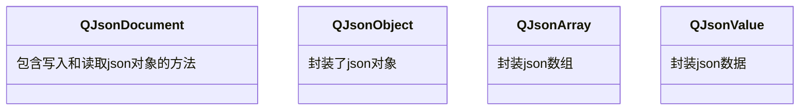

---

#### QJsonDocument

`QJsonDocument`实现了JSON格式化字符串和JSON对象之间的转换。

###### 构造

可以使用`QJsonArray`或`QJsonObject`构造`QJsonDocument`对象，通过`isEmpty()`判断文档是否是空的json对象。

除了使用构造函数，还可使用`QJsonDocument::fromJson(json)`从UTF8编码的文本构造文档对象。

###### 转换

对于有效的文档对象，可以使用`toJson()`将其转换为UTF8编码的文本字符串。可额外提供一个格式化参数。

1. `QJsonDocument::Indented`更利于阅读。

   ```json
   {
       "Array": [
           true,
           999,
           "string"
       ],
       "Key": "Value",
       "null": null
   }
   ```

2. `QJsonDocument::Compact`更利于存储。

   ```json
   {"Array":[true,999,"string"],"Key":"Value","null":null}
   ```

###### 数据访问

使用`isObject()`和`isArray()`判断文档对象是否包含一个json对象或者json数组。

使用`operator[](key)`可得到键对应的`QJsonValue`对象，如果键不存在，返回`QJsonValue::Undefined`。

---

#### QJsonObject

`QJsonObject`存放键值对列表。

###### 访问数据

使用`keys()`可获取所有的键。

使用`operator[](key)`或`value(key)`可获取指定键对应的`QJsonValue`对象，如果键不存在，返回`QJsonValue::Undefined`。

###### 添加元素

使用`insert(key, val)`项向json对象中插入一个键值对。

###### 删除数据

使用`remove(key)`从对象中删除一个键值对。

使用`take(key)`从对象中删除一个键值对，并返回删除的`QJsonValue`对象。

---

#### QJsonValue

`QJsonValue`存储json项的具体值，其可存放7种类型的数据，且拥有对应的`isXXX()`判断函数和`toXXX()`转换函数。

1. `QJsonValue::Null`，空值。
2. `QJsonValue::Bool`，布尔值。
3. `QJsonValue::Double`，数值。
4. `QJsonValue::String`，字符串。
5. `QJsonValue::Array`，数组。
6. `QJsonValue::Object`，对象。
7. `QJsonValue::Undefined`，未定义，通常在读取无效的键时，作为错误条件返回。