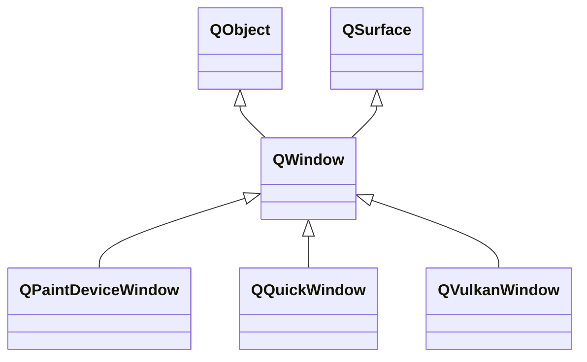

---

#### QWindow

###### 属性

| 属性               | 类型                    | 说明                                   |
| ------------------ | ----------------------- | -------------------------------------- |
| active             | `bool`                  | 窗口的激活状态。                       |
| contentOrientation | `Qt::ScreenOrientation` | 窗口内容的显示方向。                   |
| x y           | `int`                   | 窗口位置。                             |
| height width  | `int`                   | 窗口大小。                             |
| modality           | `Qt::WindowModality`    | 窗口的模态类型。                       |
| opacity            | `double`                | 窗口不透明度。                         |
| title              | `QString`               | 标题。                                 |
| visibility         | `QWindow::Visibility`   | 窗口当前状态，如正常、最小化、最大化。 |
| visible            | `bool`                  | 窗口是否可见。                         |