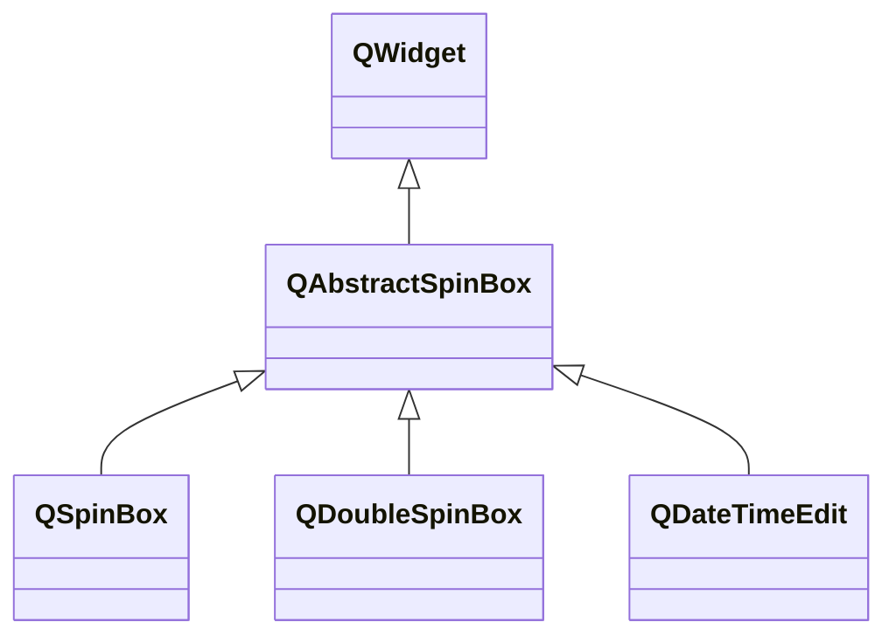

---

#### QAbstractSpinBox

###### 常用属性

| 属性               | 类型                              | 说明                                                  |
| ------------------ | --------------------------------- | ----------------------------------------------------- |
| accelerated        | `bool`                            | 长按增加、减少按钮时，是否会加快增减、减少的速度。    |
| frame              | `bool`                            | 窗口是否绘制在框架中。                                |
| readOnly           | `bool`                            | 是否只读。                                            |
| showGroupSeparator | `bool`                            | 是否显示千位分隔符。                                  |
| wrapping           | `bool`                            | 值是否循环。                                          |
| alignment          | `Qt::Alignment`                   | 文本信息的对齐方式，默认为`Qt::AlignLeft`。           |
| buttonSymbols      | `QAbstractSpinBox::ButtonSymbols` | 按钮样式，默认为`QAbstractSpinBox::UpDownArrows`。    |
| specialValueText   | `QString`                         | 设置后，当前值等于`mininum()`时，窗口显示设置的文本。 |
| text               | `QString`                         | 窗口显示的文本，包括前后缀。                          |

###### 常用信号

| 信号原型                 | 说明                                 |
| ------------------------ | ------------------------------------ |
| `void editingFinished()` | 当窗口失去焦点或者按下回车键时触发。 |

---

#### QSpinBox

`QSpinBox`用于处理整数，`QDoubleSpinBox`用于处理浮点数。

###### 常用属性

| 属性                 | 类型      | 说明                           |
| -------------------- | --------- | ------------------------------ |
| cleanText            | `QString` | 窗口显示的文本，不包括前后缀。 |
| displayIntegerBase   | `int`     | 文本显示的进制，最大为36。     |
| maximum minimum | `int`     | 最大、最小值                   |
| value                | `int`     | 当前值。                       |
| prefix suffix   | `QString` | 前、后缀                       |
| singleStep           | `int`     | 增加、减少的步长。             |

###### 常用信号

| 信号原型                                | 说明                       |
| --------------------------------------- | -------------------------- |
| `void textChanged(const QString& text)` | 当显示文本发生变化时触发。 |
| `void valueChanged(int i)`              | 当值发生变化时触发。       |

