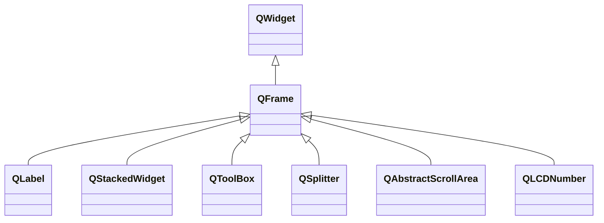

---

#### QFrame

`QFrame`是具有框架的小部件。

###### 常用属性

| 属性         | 类型             | 说明                                     |
| ------------ | ---------------- | ---------------------------------------- |
| frameRect    | `QRect`          | 框架大小，默认为整个组件。               |
| frameShadow  | `QFrame::Shadow` | 框架阴影样式。                           |
| frameShape   | `QFrame::Shape`  | 框架样式。                               |
| frameWidth   | `int`            | 框架宽度，取决于线宽、中线宽和框架样式。 |
| lineWidth    | `int`            | 框架线宽。                               |
| midLineWidth | `int`            | 框架中线宽。                             |

---

#### QLabel

`QLabel`是可以显示文本或图片的标签。

###### 常用属性

| 属性                 | 类型                       | 说明                                                         |
| -------------------- | -------------------------- | ------------------------------------------------------------ |
| alignment            | `Qt::Alignment`            | 标签内容对齐方式，默认为`Qt::AlignLeft | Qt::AlignVCenter`。 |
| margin               | `int`                      | 外边距宽度，单位为像素。                                     |
| text                 | `QString`                  | 显示的文本。                                                 |
| textFormat           | `Qt::TextFormat`           | 文本的格式，默认为`Qt::AutoText`。                           |
| selectedText         | `QString`                  | 当前选中的文本。                                             |
| hasSelectedText      | `bool`                     | 标签的文本内容是否有被选中。                                 |
| textInteractionFlags | `Qt::TextInteractionFlags` | 标签文本的交互属性。默认为`Qt::LinksAccessibleByMouse`。     |
| indent               | `int`                      | 标签的文本缩进，单位为像素。                                 |
| openExternalLinks    | `bool`                     | 是否自动打开链接。 当标签文本交互属性包含`Qt::LinksAccessibleByMouse`时，可以直接通过点击打开文本中`<a>`标签的链接。 |
| pixmap               | `QPixmap`                  | 显示的像素图。                                               |
| scaledContents       | `bool`                     | 像素图是否填充整个标签。                                     |

###### 常用函数

| 函数原型       | 说明             |
| -------------- | ---------------- |
| `void clear()` | 清除标签的内容。 |

###### 常用信号

| 信号原型                                  | 说明                           |
| ----------------------------------------- | ------------------------------ |
| `void linkActivated(const QString& link)` | 标签中的链接被点击时触发。     |
| `void linkHovered(const QString& link)`   | 鼠标移动到标签中的链接时触发。 |

---

#### QStackedWidget

`QStackedWidget`可以存放多种不同的`QWidget`作为不同的页面，但不自带切换页面的按钮。

###### 常用属性

| 属性         | 类型  | 说明               |
| ------------ | ----- | ------------------ |
| count        | `int` | 窗口页面的数量。   |
| currentIndex | `int` | 当前所处窗口索引。 |

###### 常用函数

| 函数原型                                                     | 说明                           |
| ------------------------------------------------------------ | ------------------------------ |
| `int addWidget(QWidget* widget)` `int insertWidget(int index , QWidget* widget)` | 添加页面，并返回该页面的索引。 |
| `void removeWidget(QWidget* widget)`                         | 移除页面，页面窗口不会被删除。 |
| `QWidget* widget(int index)`                                 | 获取页面。                     |

###### 常用信号

| 信号原型                         | 说明                                           |
| -------------------------------- | ---------------------------------------------- |
| `void currentChanged(int index)` | 当前页面改变时触发。                           |
| `void widgetRemoved(int index)`  | 当页面被移除时触发，传入删除后当前显示的页面。 |

---

#### QToolBox

`QToolBox`显示一列标签，其中每个标签可以显示一个`QWidget`。

###### 常用属性

| 属性       | 类型  | 说明                 |
| ---------- | ----- | -------------------- |
| count      | `int` | 标签数量。           |
| countIndex | `int` | 当前显示的标签索引。 |

###### 常用函数

| 函数原型                                                     | 说明                               |
| ------------------------------------------------------------ | ---------------------------------- |
| `int addItem(QWidget* widget, const QString& text)` `int insertItem(int index, QWidget* widget, const QString& text)` | 添加标签项。                       |
| `void removeItem(int index)`                                 | 移除标签项。                       |
| `void setItemText(int index , const QString& text)` `void setItemIcon(int index, const QIcon& icon)` `void setItemToolTip(int index , cosnt QString& tip)` | 设置标签项的文本、图标和提示信息。 |
| `void setItemEnabled(int index , bool enabled)`              | 设置标签项是否可用。               |

###### 常用信号

| 信号原型                         | 说明                   |
| -------------------------------- | ---------------------- |
| `void currentChanged(int index)` | 当前标签项改变时触发。 |

---

#### QLCDNumber

`QLCDNumber`可以以LCD的样式显示数字。
