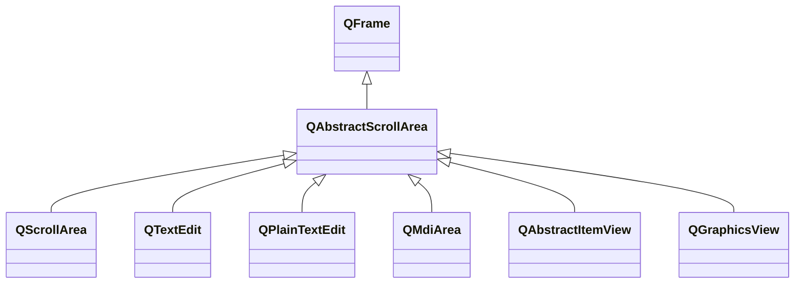

---

#### QAbstractScrollArea

###### 常用属性

| 属性                                                   | 类型                                    | 说明                                                         |
| ------------------------------------------------------ | --------------------------------------- | ------------------------------------------------------------ |
| horizontalScrollBarPolicy verticalScrollBarPolicy | `Qt::ScrollBarPolicy`                   | 水平、垂直滚动条的策略，默认为`Qt::ScrollBarAsNeeded`。      |
| sizeAdjustPolicy                                       | `QAbstractScrollArea::SizeAdjustPolicy` | 当视口部件大小变化时，滚动区域大小调整策略，默认为`QAbstractScrollArea::AdjustIgnored` |

###### 常用函数

| 函数原型                                                     | 说明                                                         |
| ------------------------------------------------------------ | ------------------------------------------------------------ |
| `void addScrollBarWidget(QWidget* widget, Qt::Alignment alignment)` | 在滚动条中加入小部件。 传入`Qt::Aligntop`或`Qt::AlignBottom`时，小部件在垂直滚动条上下。 传入`Qt::AlignLeft`或`Qt::AlignRight`时，小部件在水平滚动条左右。 |
| `void setCornerWidget(QWidget* widget)`                      | 设置两个滚动条间角落的小部间。                               |
| `void setHorizontalScrollBar(QScrollBar* scrollBar)` `void setVerticalScrollBar(QScrollBar* scrollBar)` | 设置水平、垂直滚动条。                                       |

---

#### QScrollArea

###### 常用属性

| 属性            | 类型            | 说明                                                         |
| --------------- | --------------- | ------------------------------------------------------------ |
| alignment       | `Qt::Alignment` | 滚动区小部件的对齐方式，默认为`Qt::AlignTop | Qt::AlignLeft`。 |
| widgetResizable | `bool`          | 当通过`QWidget::resize()`改变滚动区小部件大小时，是否需要自动调整部件大小，以避免显示滚动条。默认为`false`。 |

###### 常用函数

| 函数原型                          | 说明               |
| --------------------------------- | ------------------ |
| `void setWidget(QWidget* widget)` | 设置滚动区小部件。 |
| `QWidget* takeWidget()`           | 移除滚动区小部件。 |

---

#### QTextEdit

`QTextEdit`可用于查看/编辑纯文本、HTML、Markdown、图片等多种格式的内容。

如果只需要操作纯文本，可使用`QPlainTextEdit`，效率有所优化。

###### 常用属性

| 属性                  | 类型                       | 说明                                                         |
| --------------------- | -------------------------- | ------------------------------------------------------------ |
| acceptRichText        | `bool`                     | 是否接受插入富文本。默认`true`。                             |
| overwriteMode         | `bool`                     | 是否允许新文本覆盖旧文本，默认`false`。                      |
| readOnly              | `bool`                     | 是否只读，默认`false`。                                      |
| tabChangesFocus       | `bool`                     | 是否允许Tab切换焦点，默认`false`。                           |
| undoRedoEnabled       | `bool`                     | 是否允许撤销和重做。                                         |
| cursorWidth           | `int`                      | 光标的宽度，单位像素。                                       |
| plainText             | `QString`                  | 文本对应的纯文本接口。                                       |
| html                  | `QString`                  | 文本对应的HTML接口。                                         |
| markdown              | `QString`                  | 文本对应的Markdown接口。                                     |
| placeholderText       | `QString`                  | 占位文本。                                                   |
| textInteractionFlags  | `Qt::TextInteractionFlags` | 文本的可交互方式。                                           |
| lineWrapMode          | `QTextEdit::LineWrapMode`  | 文本换行模式，默认`QTextEdit::WidgetWidth`，即适应窗口宽度，且保证单词完整性。 |
| lineWrapColumnOrWidth | `int`                      | 根据换行模式不同，指定换行的像素宽度，或换行的字符数量。     |

###### 常用函数

| 函数原型                                        | 说明                                                         |
| ----------------------------------------------- | ------------------------------------------------------------ |
| `QMenu* QTextEdit::createStandardContextMenu()` | 创建标准上下文菜单。其默认会在右键点击时由`contextMenuEvent()`调用。 |
| `QTextCursor textCursor()`                      | 获取当前文本光标的副本，通过`setTextCursor()`设置当前文本的光标。 |

###### 常用信号

| 信号原型                       | 说明                                                         |
| ------------------------------ | ------------------------------------------------------------ |
| `void copyAvailable(bool yes)` | 选中或取消选中时触发。如果选中，传入`true`。                 |
| `void selectionChanged()`      | 选中文本变化时触发，可通过`textCursor().selectedText()`获取选中的文本。 |
| `void cursorPositionChanged()` | 光标位置变化时触发。                                         |
| `void textChanged()`           | 文档内容变化时触发。                                         |

