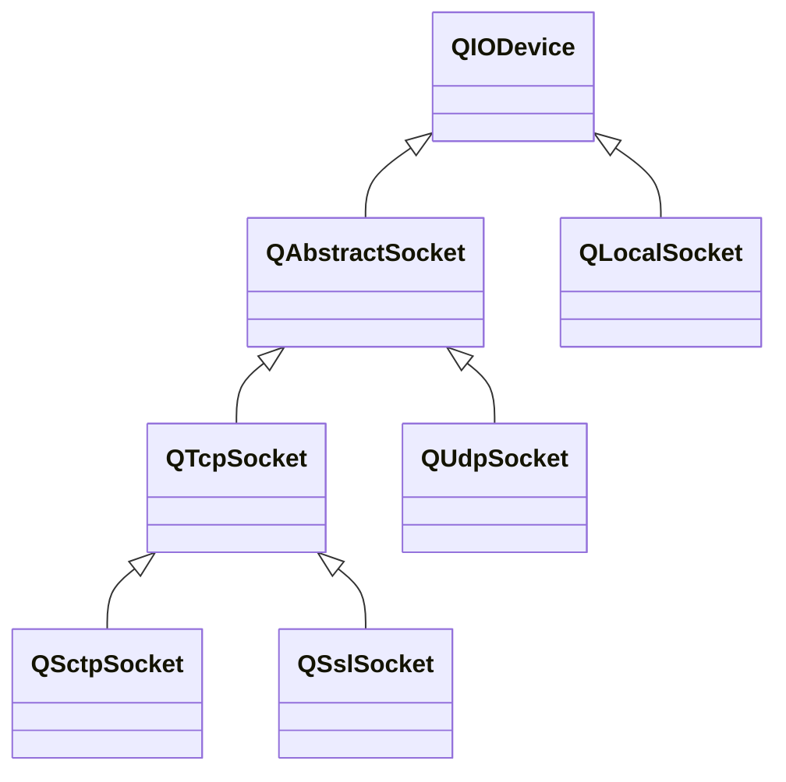

---

#### QIODevice

`QIODevice`为支持读写数据块的设备提供了一些通用的实现和一些抽象接口。支持读写的设备包括文件、缓冲区、Socket等。

###### 随机和顺序

`QIODevice`区分两种类型的设备：随机访问设备和顺序访问设备。随机访问设备可以寻找任意位置，且多次读取；顺序访问设备只能读取一次。通过`isSequential()`可判断当前设备是否是顺序访问。

对于随机访问设备，可使用`pos()`获取当前索引位置，`seek()`设置当前索引位置，`reset()`重置状态。使用`size()`获取设备字节大小。

###### 操作流程

1. `open()`打开设备并设置其访问模式。
2. 读写操作。
3. `close()`关闭设备。

###### 读写操作

使用`bytesAvailable()`和`bytesToWrite()`获取可供读取的字节和等待写入的字节。

使用`isReadable()`和`isWritable()`判断当前设备是否可读或可写，`canReadLine()`判断是否可以读取完整的一行，`atEnd()`判断是否到达设备结尾。

使用`read()`、`readLine()`、`readAll()`从设备中读取数据，`peek()`从设备中预览数据。

使用`write()`向设备写入数据。

###### 等待

当有新数据传输到设备的读取通道时，会发送`readyRead()`信号，

使用`waitForReadyRead()`阻塞等待当前设备可读，需要传入超时毫秒，传入-1将不会超时。

---

#### QAbstractSocket

`QAbstractSocket`只用于数据传输，无法作为监听socket使用。

###### 状态

`QAbstractSocket`有许多状态，可通过`state()`获取，主要有以下几种。

1. `QAbstractSocket::UnconnectedState`，未连接。
2. `QAbstractSocket::ConnectedState`，已连接。
3. `QAbstractSocket::ClosingState`，已关闭或即将关闭。

###### 选项

`QAbstractSocket`建立连接后，依然可以通过`setSocketOption()`设置socket选项，主要有以下几种。

1. `QAbstractSocket::KeepAliveOption`，保持长连接。

###### 错误处理

任何错误产生后，都会发送信号`errorOccurred()`，可使用`error()`获取上次发生的错误，`errorString()`获取错误的文本描述。

###### 连接

使用`connectToHost()`向指定主机建立连接，建立成功后，发送信号`connected()`。

使用`peerAddress()`和`peerPort()`获取对端的地址和端口信息。

###### 关闭

socket断开连接后，发送`disconnected()`信号。
