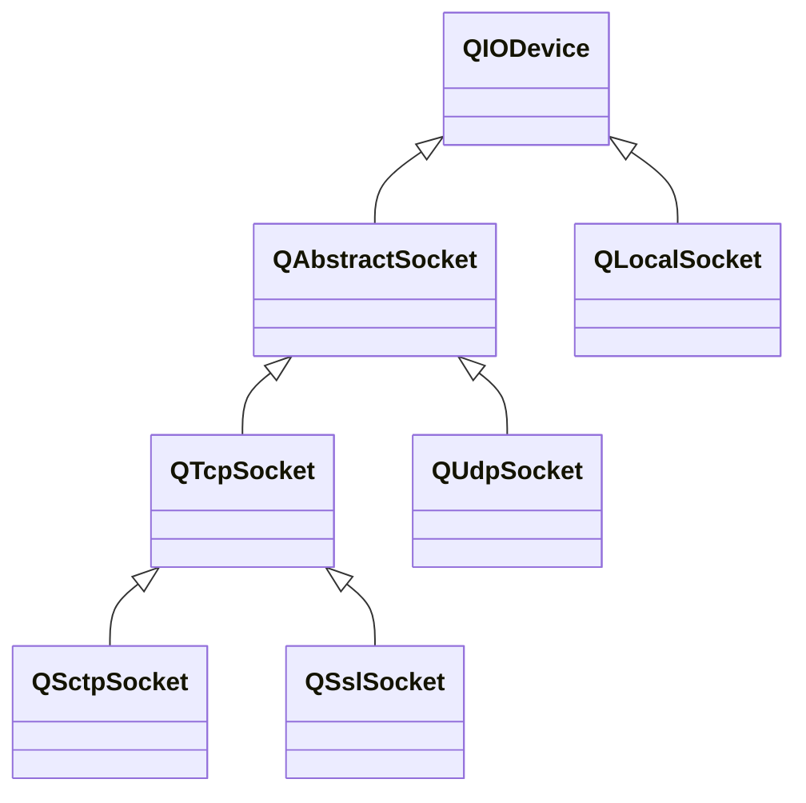

---

#### QIODevice

###### 成员函数

| 函数原型                                                     | 说明                                                         |
| ------------------------------------------------------------ | ------------------------------------------------------------ |
| `bool open(QIODeviceBase::OpenMode mode)`                    | 尝试开启设备。                                               |
| `bool isOpen()`                                              | 是否开启设备。                                               |
| `bool isReadable()` `bool isWritable()`                 | 是否可读/可写。                                              |
| `bool canReadLine()`                                         | 是否可以读取完整一行。                                       |
| `bool atEnd()`                                               | 是否到达设备结尾。                                           |
| `void close()`                                               | 关闭设备。                                                   |
| `bool isSequential()`                                        | 设备是否是顺序访问的。                                       |
| `int64_t pos()` `bool seek(int64_t pos)`                | 返回随机访问设备当前的读取/写入位置。 设置......        |
| `bool reset()`                                               | 重置随机访问设备状态。                                       |
| `int64_t bytesAvailable()` `int64_t byteToWrite()`      | 剩余有效读取字节。 剩余等待写入字节。                   |
| `int64_t size()`                                             | 对于随机访问设备，返回其大小。 对于顺序访问设备，返回`byteAvaliable()`。 |
| `QString errorString()`                                      | 上次产生错误的可读字符串。                                   |
| `int64_t skip(int64_t max_size)`                             | 跳过一些字节。                                               |
| `int64_t peek(char* data, int64_t max_size)` `QByteArray peek(int64_t maxSize)` | peek一些字节。                                               |
| `int64_t read(char* data, int64_max max_size)` `QByteArray read(int64_t max_size)` `int64_t readLine(char* data, int64_t max_size)` `QByteArray readLine(int64_t max_size = 0)` `QByteArray readAll()` | 读取一些字节。                                               |
| `bool putChar(char c)`                                       | 写入一个字符。                                               |
| `int64_t write(const char* data, int64_t max_size)` `int64_t write(const char* data)` `int64_t write(const QByteArray& data)` | 写入一些字节。                                               |
| `bool waitForReadyRead(int msecs)` `bool waitForBytesWritten(int msecs)` | 阻塞，直到可读/可写或超时。                                  |

###### 信号

| 信号原型              | 说明                     |
| --------------------- | ------------------------ |
| `void aboutToClose()` | 设备即将关闭。           |
| `void readyRead()`    | 新数据到达设备读取通道。 |

---

#### QAbstractSocket

###### 成员函数

| 函数原型                                                     | 说明                                               |
| ------------------------------------------------------------ | -------------------------------------------------- |
| `void abort()`                                               | 立即关闭套接字。                                   |
| `bool bind(QHostAddress::SpecialAddress addr, uint16_t port = 0, QAbstractSocket::BindMode mode = QAbstractSocket::DefaultForPlatform)` | 将socket绑定到指定地址和端口。                     |
| `void connectToHost(const QHostAddress &address, quint16 port, QIODeviceBase::OpenMode openMode = QIODeviceBase::ReadWrite)` | 尝试向指定主机建立连接。                           |
| `void disconnectFromHost()`                                  | 尝试关闭套接字，如有数据等待写入，写入完成后关闭。 |
| `bool flush()`                                               | 刷新应用层缓冲区。                                 |
| `int64_t readBufferSize()`                                   | 读缓冲区大小。0表示无限大小，不会导致数据丢失。    |
| `bool isValid()`                                             | socket是否有效。只有有效时才能进行读写操作。       |
| `QHostAddress localAddress()` `uint16_t localPort()`    | socket绑定的本地地址和端口。                       |
| `QHostAddress peerAddress()` `uint16_t peerPort()`      | socket绑定的对端地址和端口。                       |
| `QVariant socketOption(QAbstractSocket::SocketOption option)` | socket选项。                                       |
| `QNetworkProxy proxy()`                                      | socket使用的代理。                                 |
| `QAbstractSocket::SocketError error()`                       | socket上次产生的错误。                             |

###### 信号

| 信号原型                                                 | 说明       |
| -------------------------------------------------------- | ---------- |
| `void connected()`                                       | 建立连接。 |
| `void disconnected()`                                    | 断开连接。 |
| `void errorOccurred(QAbstractSocket::SocketError error)` | 产生错误。 |

