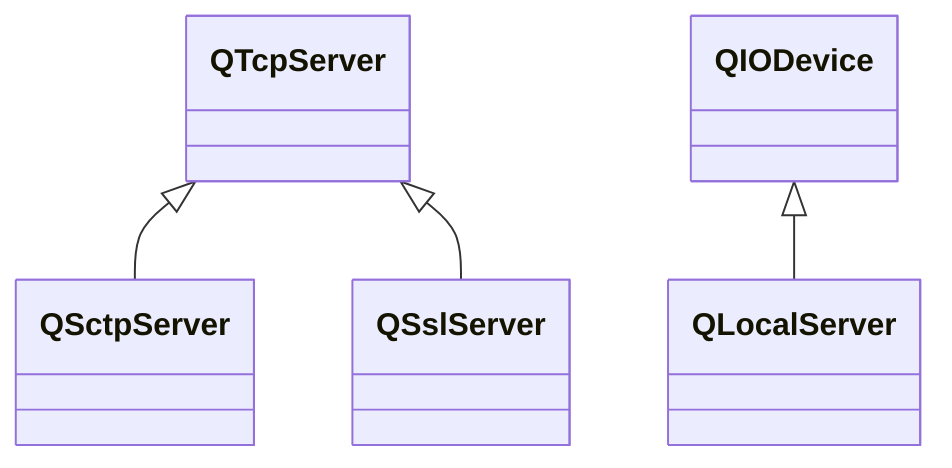

---

#### QTcpServer

###### 成员函数

| 函数原型                                                     | 说明                                                   |
| ------------------------------------------------------------ | ------------------------------------------------------ |
| `void close()`                                               | 关闭服务器，结束监听。                                 |
| `void pauseAccepting()` `void resumeAccepting()`        | 暂停/恢复接受新连接。                                  |
| `bool listen(const QHostAddress &address = QHostAddress::Any, quint16 port = 0)` | 开始监听。端口为0，将自动选择端口。                    |
| `int listenBacklogSize()`                                    | 监听等待队列大小。                                     |
| `int maxPendingConnections()`                                | 挂起的已接收连接的最大数量。                           |
| `QTcpSocket* nextPendingConnection()`                        | 下一个挂起的已接收连接。                               |
| `QHostAddress serverAddress()` `uint16_t serverPort()`  | 服务器地址/端口。                                      |
| `QNetworkProxy proxy()`                                      | 服务器使用代理。                                       |
| `QAbstractSocket::SocketError serverError()`                 | 最后一次产生的错误码。                                 |
| `bool waitForNewConnection(int msec = 0, bool* timedOut = nullptr)` | 阻塞，直到接受到新连接或超时。`msrc`为-1时，不会超时。 |

###### 信号

| 信号原型               | 说明         |
| ---------------------- | ------------ |
| `void newConnection()` | 有新连接可用 |

