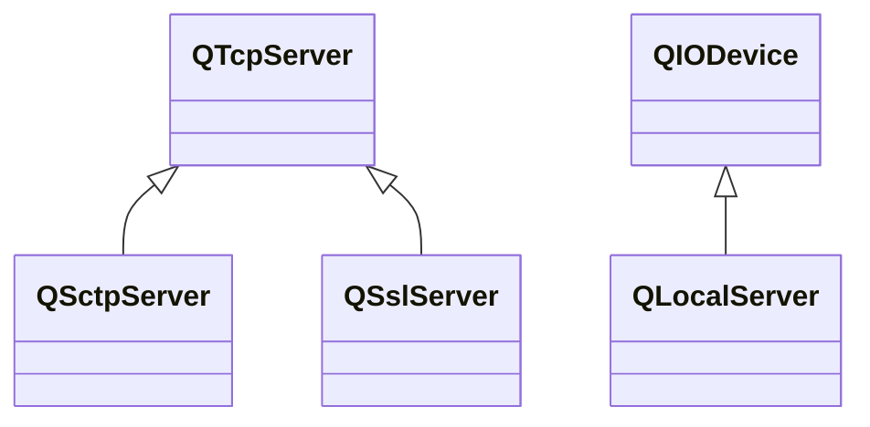

---

#### QTcpServer

`QTcpServer`用于监听以及管理连接的socket。

###### 错误处理

当接受新连接导致错误时，发送`acceptError()`信号。使用`serverError()`获取错误码，`errorString()`获取错误描述字符串。

###### 使用流程

1. 使用`listen()`设置主机地址和端口，并开启监听。
2. 当有新连接可用时，发送`newConnection()`信号。或使用`wiatForNextNewConnection()`阻塞等待新连接或超时。
3. 使用`nextPendingConnection()`获取挂起的已接收连接。
4. 使用`pauseAccepting()`和`resumeAccepting()`暂停、恢复接受新连接。使用`close()`结束监听。

###### 监听socket属性

`QTcpServer`没有提供设置监听socket属性的方式，只能通过系统api创建socket，设置属性并开启监听后，使用`setSocketDescriptor()`设置`QTcpServer`使用的socket。

```cpp
int main(int argc, char *argv[])
{
    QCoreApplication app(argc, argv);

    int sockfd = socket(AF_INET, SOCK_STREAM, 0);

    int flag = 1;
    setsockopt(sockfd, SOL_SOCKET, SO_REUSEADDR, &flag, sizeof(flag));

    sockaddr_in sockad;
    sockad.sin_family = AF_INET;
    sockad.sin_addr.s_addr = INADDR_ANY;
    sockad.sin_port = htons(8888);

    assert(bind(sockfd, (struct sockaddr *) &sockad, sizeof(sockad)) == 0);

    assert(listen(sockfd, SOMAXCONN) == 0);

    QTcpServer server;
    server.setSocketDescriptor(sockfd);

    QObject::connect(&server, &QTcpServer::newConnection, [&server]() {
        auto client = server.nextPendingConnection();
        qDebug() << client->peerAddress().toString() << ":"
                 << client->peerPort() << "  connect";
    });

    return QCoreApplication::exec();
}
```

