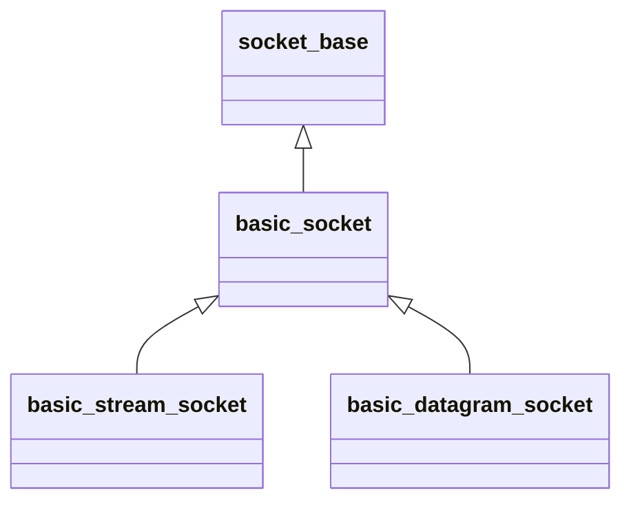

`asio::socket_base`提供通用的socket选项。

`asio::basic_socket`提供通用的socket操作，如绑定地址、连接主机、发送和接收消息。

`asio::basic_stream_socket`提供基于流式协议的操作接口，`asio::ip::tcp::socket`是基于tcp协议的具体实现。

`asio::basic_datagram_socket`提供基于数据报协议的接口，`asio::ip::udp::socket`是基于udp协议的具体实现。

---

#### basic_socket

###### 构造

`basic_socket`拥有多个重载的构造函数，执行不同操作。

* `basic_socket(context)`，构造但不打开套接字。

* `basic_socket(context, protocol)`，构造并打开套接字。
* `basic_socket(context, endpoint)`，构造并将其绑定到本地端点。

使用`is_open()`判断是否打开，使用`open(protocol)`用制定协议打开。

###### 端点

使用`bind(endpoint)`绑定到本地端点。

获取端点：

* `local_endpoint()`获取本地端点。
* `remote_endpoint()`获取对端端点。

###### 连接

连接前必须绑定到本地端点，如果此时未打开，其会自动打开。

使用`connect(peer_ep)`同步连接到对端，如果连接失败，抛出相关异常。 

使用`async_connect(peer, token)`异步连接到对端，其中token是原型为`void(const asio::error_code&)`的可调用对象。

###### 等待

使用`wait(wtype)`同步等待套接字相关事件，其中wtype可以是一下几种：

* `basic_socket::wait_read`。
* `basic_socket::wait_write`。
* `basic_socket::wait_error`。

使用`asycn_wait(wtype, token)`异步等待套接字相关事件。

###### 数据

使用`avaliable()`获取当前可读取的字节数。

---

#### basic_stream_socket

###### 读

使用`read_some(buf)`同步读取数据，返回读取的字节数量。

使用`async_read_some(buf, token)`异步读取数据，其中token是原型为`void(const asio::error_code&, size_t byte_readen)`的可调用对象。

###### 写

使用`write_some(buf)`同步写入数据，返回写入的字节数量。

使用`async_write_some(buf, token)`异步写入数据。
