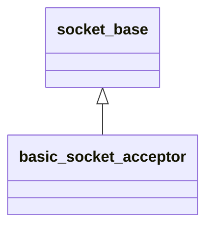

`asio::basic_socket_acceptor`提供接受新连接的接口，`asio::ip::tcp::acceptor`是基于tcp协议的具体实现。

###### 构造

basic_socket_acceptor提供了多个重载的构造函数，但通常直接使用`basic_socket_acceptor(context, endpoint)`创建打开并绑定到本地端口的acceptor。

###### 监听

使用`listen()`开启监听。

###### 连接

使用`accept(remotesock)`同步等待连接。

使用`async_accept(token)`异步等待连接，其中token是原型为`void(const asio::error_code&, asio::ip::tcp::socket sock)`的可调用对象。