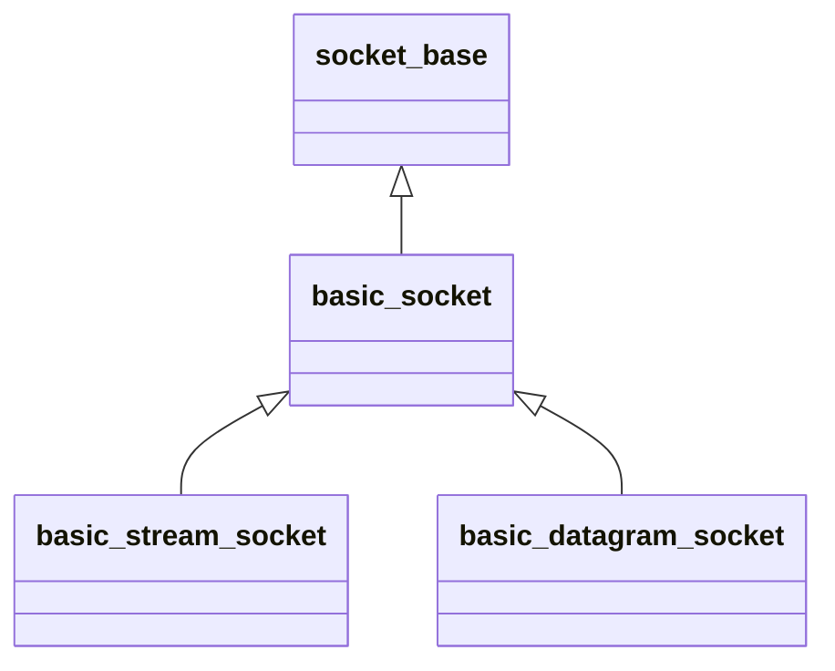

`asio::socket_base`负责定义套接字公有的属性，`asio::basic_socket`提供套接字基本功能。

`basic_stream_socket`提供面向流的套接字功能，`asio::basic_datagram_socket`提供面向数据报的套接字功能。

通常直接使用`asio::ip::tcp::socket`和`asio::ip::udp::socket`。

---

#### basic_socket

###### 构造

`basic_socket`拥有多个重载的构造函数，执行不同操作。

1. `basic_socket(context)`，构造但不打开套接字。
2. `basic_socket(context, protocol)`，构造并打开套接字。
3. `basic_socket(context, endpoint)`，构造并将其绑定到本地端点。

使用`is_open()`判断是否打开，使用`open(protocol)`用制定协议打开。

###### 端点

使用`bind(endpoint)`绑定到本地端点。

使用`local_endpoint()`获取绑定的本地端点，使用`remote_endpoint()`获取绑定的对端端点。

###### 连接

连接前必须绑定到本地端点，如果此时未打开，其会自动打开。

使用`connect(peer_ep)`同步连接到对端，如果连接失败，抛出相关异常。 

使用`async_connect(peer, token)`异步连接到对端。

1. `token`，原型为`void(const asio::error_code&)`。

###### 等待

使用`wait(wtype)`同步等待套接字相关事件。

1. `wtype`，`basic_socket::wait_read`、`basic_socket::wait_write`或`basic_socket::wait_error`。

使用`asycn_wait(wtype, token)`异步等待套接字相关事件。

1. `token`，原型为`void(const asio::error_code&)`。

###### 数据

使用`avaliable()`获取当前可读取的字节数。

---

#### basic_stream_socket

###### 读

使用`read_some(buf)`同步读取数据，返回读取的字节数量。

使用`async_read_some(buf, token)`异步读取数据。

1. `token`，原型为`void(const asio::error_code&, size_t byte_readen)`。

###### 写

使用`write_some(buf)`同步写入数据，返回写入的字节数量。

使用`async_write_some(buf, token)`异步写入数据。

1. `token`，原型为`void(const asio::error_code&, size_t byte_written)`。
