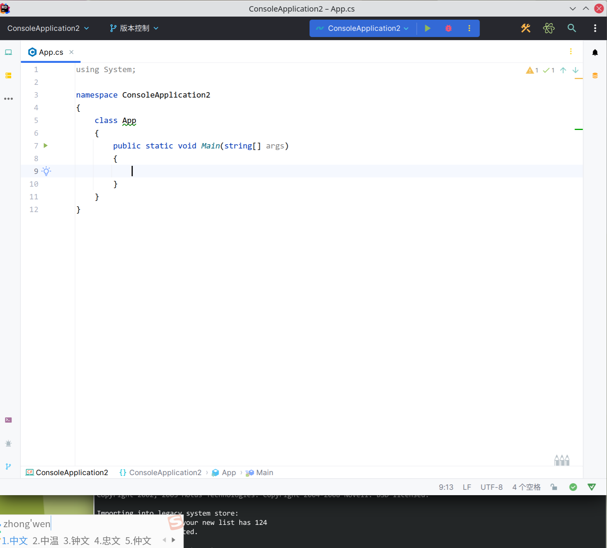

#### 问题描述

Jetbrain系列中，输入法无法跟随当前光标位置。



---

#### 解决方案一

1. 从https://github.com/RikudouPatrickstar/JetBrainsRuntime-for-Linux-x64下载编译后的jbr文件。
2. 替换IDE安装目录下的jbr。

---

#### 解决方案二

1. 下载JetBrainsRuntime和patch

   ```sh
   git clone https://github.com/JetBrains/JetBrainsRuntime.git
   git clone https://github.com/prehonor/myJetBrainsRuntime.git
   ```

2. 安装依赖

   ```sh
   sudo apt install autoconf make build-essential libx11-dev libxext-dev libxrender-dev libxtst-dev libxt-dev libxrandr-dev libcups2-dev libfontconfig1-dev libasound2-dev openjdk-11-jdk
   ```

3. 编译文件

   ```sh
   # 赋值idea.path到JetBrainsRuntime目录
   cp myJetBrainsRuntime/idea.patch JetBrainsRuntime
   
   # 配置文件，需要JDK版本 >= 19
   cd jetBrainsRuntime
   sh ./configure
   
   # 编译
   make images
   ```

4. 迁移相关文件

   ```sh
   cd build/linux-x86_64-server-release
   sudo cp -r jdk support ~/Applications/JetbrainsJDK
   ```

5. 配置JetBrains IDE加载JDK路径，在各个IDE的xx.sh文件中，如clion.sh或rider.sh中加入下属环境

   ```sh
   # Clion配置
   export CLION_JDK=~/Applications/JetbrainsJDK/jdk
   
   # Rider配置
   export RIDER_JDK=~/Applications/JetbrainsJDK/jdk
   ```
   
   