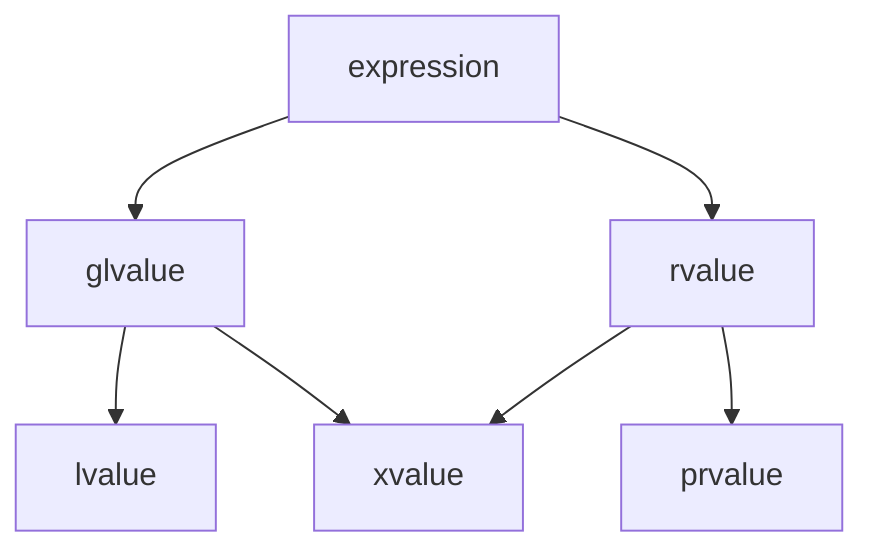

[toc]

c++表达式可以通过[类型]()和[值类别]()两种独立的方式进行分类。每个表达式都属于三种基本值类别中的一种：『[纯右值](#纯右值)，prvalue』、『[左值](#左值)，lvalue』和『[亡值](#亡值)，xvalue』。



## 基本类别

### 纯右值

以下表达式是纯右值：

    1. 除了字符串字面量之外的字面量。
    2. 返回非引用的函数调用或重载运算符表达式。
    3. 内置后置自增自减表达式。
    4. 内置布尔逻辑表达式。
    5. 内置取地址表达式。
    6. 『`a.m`』，对象成员表达式，其中m是成员枚举项或非静态成员函数。
    7. 『`p->m`』，内置指针成员表达式，其中m是成员枚举项或非静态成员函数。
    8. 『`a, b`』，逗号表达式，其中b是右值。
    9. [this指针]()。
    10. 枚举项。
    11. 具有标量类型的非类型模板形参。
    12. [lambda表达式]()。
    13. [requires表达式]()。

其性质有：

1. 纯右值不具有[多态]()。
2. 非类、非数组的纯右值不能具有[cv限定]()（函数调用或转型表达式可能产生非类的cv限定纯右值，但会被剔除）。[示例](#示例6)
3. 纯右值不能是[不完整类型]()（除了void，或在decltype中使用）。
4. 纯右值不能是[抽象类类型]()或其数组。
5. 参考[右值](#右值)。

### 左值

以下表达式是左值：

1. 变量、函数、模板参数对象或数据成员的名称，与类型无关（变量的类型是右值引用不影响其名称组成的表达式是左值表达式）。
2. 返回左值引用的函数调用或重载运算符表达式。
3. 内置赋值表达式、复合赋值表达式。
4. 内置前置自增自减表达式。
5. 内置解引用表达式。
6. 内置下标表达式（操作数是数组左值）。
7. 『`a.m`』，对象成员表达式（除非m是成员枚举项或非静态成员函数，或a是右值且m是非静态数据成员）。
8. 『`p->m`』，内置指针成员表达式（除非m是成员枚举项或非静态成员函数）。[示例](#示例1)。
9. 『`a, b`』，内置逗号表达式，其中b是左值。
10. 『`a ? b : c`』，三元表达式，其中b和c都是左值。[示例](#示例2)
11. 字符串字面量。[示例](#实例3)
12. 具有左值引用的非类型模板形参。[示例](#示例4)

其性质有：

1. 可通过内置取值运算符取地址。
2. 可修改左值可作为内置赋值运算符的左操作数。
3. 左值可初始化[左值引用]()。
4. 参考[泛左值](#泛左值)。

### 亡值

以下表达式是亡值：

1. 『`a.m`』，对象成员表达式，其中a是右值且m是非静态数据成员。
2. 『`a.*mp`』，对象成员指针表达式，其中a是右值且mp是数据成员指针。
3. 某些三元表达式。
4. 返回右值引用的函数调用或重载运算符表达式，如[std::move]()。
5. 『`a[n]`』，内置下标运算符，操作数之一是数组右值。
6. 转换到右值引用的类型类型转换表达式。
7. [临时量实质化]()后，任何指代该对象的表达式。
8. 有[移动资格]()的表达式。

## 混合类型

### 泛左值

泛左值包括左值和亡值，其性质有：

1. 泛左值可通过左值到右值、数组到指针或函数到指针的[隐式转换]()到纯右值。
2. 泛左值可以是[多态]()。
3. 泛左值可以是[不完整类型]()。[示例](#示例5)

### 右值

右值包括纯右值和亡值，其性质有：

* 右值不能被内置取址运算符取地址。
* 右值不能作为内置赋值运算符的左操作数。
* 右值可初始化[常量左值引用]()和[右值引用]()，且被延长生命周期。
* 当函数重载参数具有[常量左值引用]()和[右值引用]()时，对于右值实参，重载决策选择右值引用的重载。

# 示例

## 示例1

```cpp
#define is_lvalue(v) std::is_lvalue_reference_v<decltype((v))>

auto main() -> int {
    auto p = std::make_pair(0, 0);
    auto pp = &p;

    std::cout << is_lvalue(p.first) << "\n";               // true
    std::cout << is_lvalue(std::move(p).first) << "\n";    // false
    std::cout << is_lvalue(std::move(pp)->first) << "\n";  // true

    return 0;
}
```

## 示例2

```cpp
#define is_lvalue(v) std::is_lvalue_reference_v<decltype((v))>

auto main() -> int {
    int i;
    std::cout << is_lvalue(true ? i : std::move(i)) << "\n";   // false
    std::cout << is_lvalue(false ? i : std::move(i)) << "\n";  // false

    return 0;
}
```

## 实例3

```cpp
#define is_lvalue(v) std::is_lvalue_reference_v<decltype((v))>

auto main() -> int {
    std::cout << is_lvalue("hello") << "\n";  // true

    return 0;
}
```

## 示例4

```cpp
#define is_lvalue(v) std::is_lvalue_reference_v<decltype((v))>

template <size_t& N>
auto call() -> void {
    std::cout << is_lvalue(N) << "\n";
}

size_t i;
auto main() -> int {
    call<i>();  // true

    return 0;
}
```

## 示例5

```cpp
struct T;

auto main() -> int {
    T *p = nullptr;  // p是不完整类型指针，位于赋值运算符左侧，属于泛左值表达式
    
    return 0;
}
```

## 示例6

```cpp
auto main() -> int {
    using const_int_t = const int;
    using const_arr_t = const int[1];
    using const_vec_t = const std::vector<int>;

    std::cout << std::is_const_v<decltype(const_int_t{})> << "\n";  // false
    std::cout << std::is_const_v<decltype(const_arr_t{})> << "\n";  // true
    std::cout << std::is_const_v<decltype(const_vec_t{})> << "\n";  // true

    return 0;
}
```

