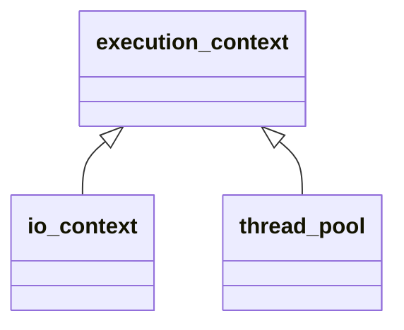

`asio::execution_context`提供可拓展、类型安全、多态地管理服务的方式。

其只负责管理服务的生命周期，不负责管理服务的具体调用，每种类型的服务只能存在一个。

###### 服务管理

保护成员函数：

* `.destroy()`，销毁上下文中所有服务。
* `.shutdown()`，关闭上下文中所有服务。

友元函数：

* `asio::make_service<Service>(context, args...)`向上下文中添加服务，服务唯一。
* `asio::has_service<Service>(context)`判断是否包含某种服务。
* `asio::use_service<Service>(context)`获取上下文中的服务，不会移交所有权。

###### 服务

所有服务都需要是`execution_context::service`的派生类。

公共成员函数：

* `.context()`获取绑定的上下文。

私有成员函数：

* `.notify_fork()`，当上下文产生fork事件时调用。
* `.shutdown()`，纯虚函数，显示关闭服务，上下文销毁前调用。

在定义服务类时，类中还需要包含静态成员`asio::execution_context::id id`作为服务的唯一标识。

```cpp
#include <iostream>
#include <format>
#include <asio.hpp>

class service : public asio::execution_context::service
{
public:
    inline static asio::execution_context::id id{};
    service(asio::execution_context &con) : asio::execution_context::service{con} { std::cout << "init\n"; }
    ~service() { std::cout << "destroy\n"; }

private:
    void shutdown() override { std::cout << "shutdown\n"; }
};

int main()
{
    asio::execution_context con;
    asio::make_service<service>(con);
    /*
        init
        shutdown
        destroy
    */

    return 0;
}
```

