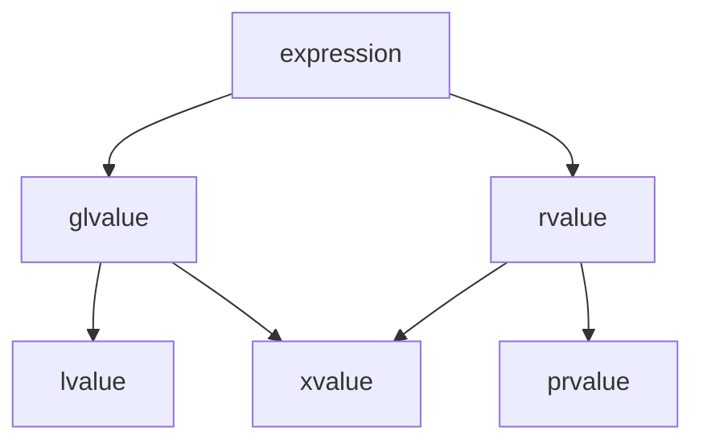

c++中的所有表达式都可以根据下图进行分类。

```mermaid
graph TD
    expression --> glvalue
    expression --> rvalue
    glvalue --> lvalue
    glvalue --> xvalue
    rvalue --> prvalue
    rvalue --> xvalue

```

xvalue（eXpring value）表示资源可重用的对象。

#### 左值

#### 纯右值

> 13. 
