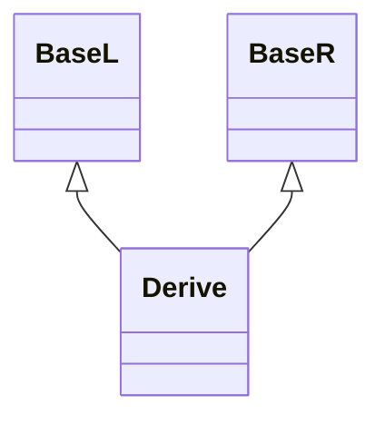

[toc]

对于所有转型表达式，其结果：

* 如果『新类型』是『左值引用』或『函数类型的右值引用』，结果是[左值]()。
* 如果『新类型』是『对象类型的右值引用』，结果是[亡值]()。
* 否则，结果是[纯右值]()。

## static_cast

[static_cast]()可用于不修改[cv限定]()的转换。其有如下特性：

* 如果存在从『表达式』到『新类型』的转换，或存在可行的[直接初始化]()，[static_cast]()将返回『新类型』的临时对象。[示例](#示例1)
* [整数]()、[浮点]()或[枚举]()可以转换到任何完整的[枚举类型]()：
  * 如果枚举底层类型不固定，当『表达式』的值位于范围之外时，行为未定义。
  * 否则，其结果为将『表达式』转换为枚举底层类型，再转换为『枚举类型』。

## dynamic_cast

[dynamic_cast]()可用于[多态类型]()间转换时的安全性。如果转换指针失败，返回空指针；如果转换引用失败，抛出[std::bad_cast]()异常。[示例](#示例2)

在不移除[dv限定]()时，其转换遵守以下规则：

* 如果『新类型』是基类的指针或引用，『表达式』是派生类的指针或引用，且为[单一继承]()，则转换结果是『表达式基类子对象的指针或引用』。
* 如果『表达式』是指向[多态类型]()的指针，[新类型]()是[void]()指针，则转换结果是『表达式指向类型的最终派生对象的地址』[^1]。[示例](#示例3)
* 如果『表达式』是[多态类型]()基类的指针或引用，[新类型]()是派生类的指针或引用，会进行运行时检查：
  1. 尝试[向下转型，downcast]()[^2]。
  2. 尝试[侧向转型，sidecast]()。[示例](#示例4)
  3. 转换失败，返回空指针或抛出异常。

## const_cast

## reinterpret_cast

# 示例

## 示例1

```cpp
struct T {};

struct U {
    U(const T&) { std::cout << "U(const T&F)\n"; }
};

auto main() -> int {
    static_cast<U>(T{});  // U(const T&F)

    return 0;
}
```

## 示例2

```cpp
struct Base {
    virtual ~Base() = default;
};

struct Derive1 : public Base {};

struct Derive2 : public Base {};

auto main() -> int {
    Base *bp = new Derive1;
    std::cout << dynamic_cast<Derive2 *>(bp) << "\n";   // 0
    Base &&br = Derive1{};
    try { dynamic_cast<Derive2 &&>(br); } catch (...) {
        std::cout << "exception\n";                     // exception
    }

    return 0;
}
```

## 示例3

```cpp
struct Base1 {
    virtual ~Base1() = default;
    int i;
};

struct Base2 {
    virtual ~Base2() = default;
};

struct Derive : public Base1, public Base2 {};

auto main() -> int {
    Base1 *bp1 = new Derive;
    std::cout << ((char *) bp1 - (char *) dynamic_cast<void *>(bp1)) << "\n";   // 0

    Base2 *bp2 = new Derive;
    std::cout << ((char *) bp2 - (char *) dynamic_cast<void *>(bp2)) << "\n";   // 16
    // 『Base2子对象』的起始地址存在『Base1子对象大小』的偏移量
    std::cout << sizeof(Base1) << "\n";                                         // 16

    return 0;
}
```

## 示例4




```cpp
struct BaseL { virtual ~BaseL() = default; };
struct BaseR { virtual ~BaseR() = default; };
struct Derive : public BaseL, public BaseR {};

auto main() -> int {
    BaseL *bp = new Derive;
    std::cout << (dynamic_cast<BaseR *>(bp) != nullptr);    // true

    return 0;
}
```


[^1]:在[多继承]()情况下，可能会使转换后的指针指向内存不同
[^2]:将基类指针或引用转换为派生类指针或引用
