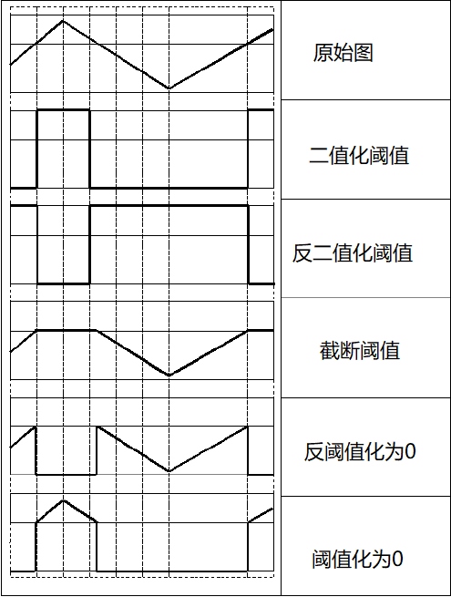

#### 固定阈值操作

使用`cv::threshold(src, dst, thresh, maxval, type)`对单通道图像进行固定阈值操作。

1. `thresh`，阈值。

2. `type`，阈值类型，常用的有：

   1. `cv::THRESH_BINARY`，数学公式为：
      $$
      \begin{equation}
      dst(x, y)=\left\{
      \begin{aligned}
      maxval & & src(x, y) \gt thresh\\
      0 &  & otherwise
      \end{aligned}
      \right.
      \end{equation}
      $$

   2. `cv::THRESH_TRUNC`，数学公式为：
      $$
      \begin{equation}
      dst(x, y)=\left\{
      \begin{aligned}
      thresh & & src(x, y) \gt thresh\\
      src(x, y) &  & otherwise
      \end{aligned}
      \right.
      \end{equation}
      $$

   3. `cv::THRESH_TOZERO`，数学公式为：
      $$
      \begin{equation}
      dst(x, y)=\left\{
      \begin{aligned}
      src(x, y) & & src(x, y) \gt thresh\\
      0 &  & otherwise
      \end{aligned}
      \right.
      \end{equation}
      $$

---

#### 自适应阈值操作

使用`cv::adaptiveThreshold(src, dst, maxval, method, type, block_size, c)`对单通道图像进行自适应阈值操作。

1. `method`，自适应阈值算法。
2. `type`，必须是`cv::THRESH_BINARY`或`cv::THRESH_BINARY_INV`。
3. `c`，阈值算法中的常数。