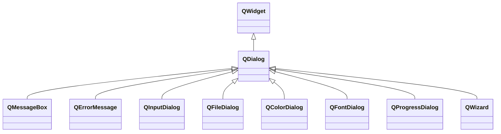

---

#### QDialog

###### 常用属性

| 属性            | 类型   | 说明                                                         |
| --------------- | ------ | ------------------------------------------------------------ |
| modal           | `bool` | 是否以模态的方式显示对话框。模态对话框显示后必须先进行交互。 |
| sizeGripEnabled | `bool` | 是否拥有`QSizeGrip`。                                        |

###### 常用函数

| 函数原型       | 说明             |
| -------------- | ---------------- |
| `int result()` | 对话框的返回值。 |

###### 常用信号

| 信号原型                    | 说明                   |
| --------------------------- | ---------------------- |
| `void accepted()`           | 对话框被接受时触发。   |
| `void rejected()`           | 对话框被拒绝时触发。   |
| `void finished(int result)` | 对话框产生结果时触发。 |

---

#### QMessageBox

###### 常用属性

| 属性                 | 类型                          | 说明                                          |
| -------------------- | ----------------------------- | --------------------------------------------- |
| text                 | `QString`                     | 对话框显示的文本信息。                        |
| informativeText      | `QString`                     | 对话框显示的更详细的信息。                    |
| detailedText         | `QString`                     | 对话框显示的额外详细信息，通过按钮打开。      |
| textFormat           | `Qt::TextFormat`              | 设置`text`的文本类型，如纯文本或MarkDown。    |
| textInteractionFlags | `Qt::TextInteractionFlags`    | 设置`text`和用户的交互类型。                  |
| icon                 | `QMessageBox::Icon`           | 对话框中的图标，默认为`QMessageBox::NoIcon`。 |
| iconPixmap           | `QPixmap`                     | 对话框窗口的图标。                            |
| standardButtons      | `QMessageBox::StandardButton` | 对话框显示的所有标准按钮。                    |

###### 常用静态函数

| 函数原型                                                     | 说明                         |
| ------------------------------------------------------------ | ---------------------------- |
| `void about(QWidget* parent, const QString& title, const QString& text)` | 显示一个基本模态对话框。     |
| `void aboutQt(QWidget* parent, const QString& title = QString())` | 显示一个关于QT的模态对话框。 |

###### 常用信号

| 信号原型                                      | 说明                             |
| --------------------------------------------- | -------------------------------- |
| `void buttonClicked(QAbstractButton *button)` | 对话框中的标准按钮被点击时触发。 |

---

#### QFileDialog

###### 常用属性

| 属性       | 类型                      | 说明                                                         |
| ---------- | ------------------------- | ------------------------------------------------------------ |
| acceptMode | `QFileDialog::AcceptMode` | 定义对话框是用于打开文件还是保存文件。默认为`QFileDialog::AcceptOpen`。 |
| fileMode   | `QFileDialog::FileMode`   | 定义对话框可选择项目的数量和类型。                           |
| options    | `QFileDialog::Option`     | 定义对话框的额外属性，如只显示文件夹。                       |

###### 常用函数

| 函数原型                                                     | 说明                             |
| ------------------------------------------------------------ | -------------------------------- |
| `void setLabelText(QFileDialog::DialogLabel label, const QString& text)` | 设置对话框中标签显示的文本内容。 |
| `void setFilter(QDir::Filters filters)` `void setMimeTypeFilters(const QStringList& filters)` `void setNameFilter(const QString& filter)` `void setNameFilters(const QStringList& filters)` | 设置对话框过滤器。               |

###### 常用静态函数

| 函数原型                                                     | 说明       |
| ------------------------------------------------------------ | ---------- |
| `QString getExistingDirectory(QWidget* parent = nullptr, ...)` | 选择目录。 |
| `QString getOpenFileName(QWidget* parent = nullptr, ...)` `QString getOpenFileNames(QWidget* parent = nullptr, ...)` `QString getSaveFileName(QWidget* parent = nullptr, ...)` | 选择文件。 |

###### 常用信号

| 信号原型                                          | 说明                           |
| ------------------------------------------------- | ------------------------------ |
| `void currentChanged(const QString& path)`        | 当前选中的文件发生变化时触发。 |
| `void directoryEntered(const QString& directory)` | 当前目录发生变化时触发。       |
| `void filesSelected(const QStringList& selected)` | 选中文件且接受时触发。         |

---

#### QProgressDialog 

###### 常用属性

| 属性        | 类型      | 说明                                   |
| ----------- | --------- | -------------------------------------- |
| autoClose   | `bool`    | 重置时是否自动隐藏窗口，默认为`true`。 |
| autoReset   | `bool`    | 进度完成是否自动重置，默认为`true`。   |
| labelText   | `QString` | 对话框显示的文本信息。                 |
| maximum     | `int`     | 进度最大值，默认100。                  |
| minimum     | `int`     | 进度最小值，默认0。                    |
| value       | `int`     | 当前进度。                             |
| wasCanceled | `bool`    | 对话框是否被取消。                     |

###### 常用函数

| 函数原型                                          | 说明                         |
| ------------------------------------------------- | ---------------------------- |
| `void setBar(QProgressBar* bar)`                  | 自定义对话框显示的进度条。   |
| `void setCancelButton(QPushButton* cancelButton)` | 自定义对话框显示的取消按钮。 |
| `void setLabel(QLabel* label)`                    | 自定义对话框显示的文本标签。 |

###### 常用信号

| 信号原型          | 说明                 |
| ----------------- | -------------------- |
| `void canceled()` | 取消按钮点击时触发。 |

