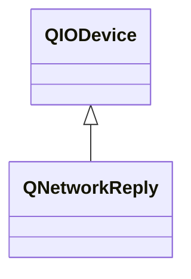

---

#### QNetworkReply

`QNetworkReply`是一个顺序访问设备，一旦从中读取数据，其就不再维护。

###### 成员函数

```cpp
// 头信息以及原始头信息。
QVariant header(QNetworkRequest::KnownHeaders header_name);
QByteArray rawHeader(const QByteArray& header_name);
QList<QByteArray> rawHeaderList();
const QList<QNetworkReply::RawheaderPair>& rawHeaderPairs();
```

```cpp
// 响应对应的请求。
QNetworkRequest request();
```

