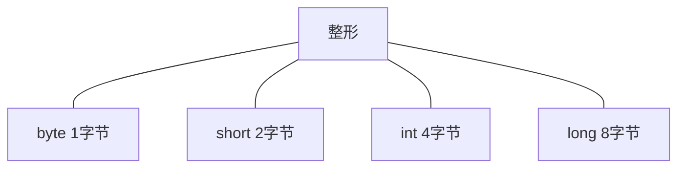
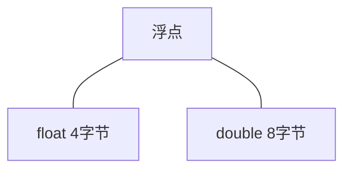

#### 基本数据类型

###### 整形

后缀`L`表示长整形常量。



###### 浮点型

后缀`F`表示单精度浮点常量。



`Double.NaN`表示非数值，所有非数值都不相同。如果需要判断是否是非数值，使用`Double.isNaN()`。

###### 字符型

Java在编译前会代码中出现的所有转义序列转换为对应的字符串。

```java
public static void main(String[] args) {
    System.out.println("hello\u0022");      // 未结束的字符串文本
    // c:\user      这段注释也会报错，因为非法的unicode转义序列
}
```

###### 布尔

Java中整形和布尔类型不能进行隐式转换，且条件表达式必须是布尔类型。

---

#### 包装器

因为基本数据类型不属于类，而在某些地方需要使用类类型对象，所以Java为每一个基本数据类型都定义了一个与之对应的类类型。如`int`对应`Integer`，`double`对应`Double`、`boolean`对应`Boolean`。

在需要包装器的地方，可以直接传递其对应基本类型数据，称为自动装箱。

也可以直接将包装器对象赋值给其对应的基本类型变量，称为自动拆箱。

> 装箱和拆箱的过程由编译器完成。
