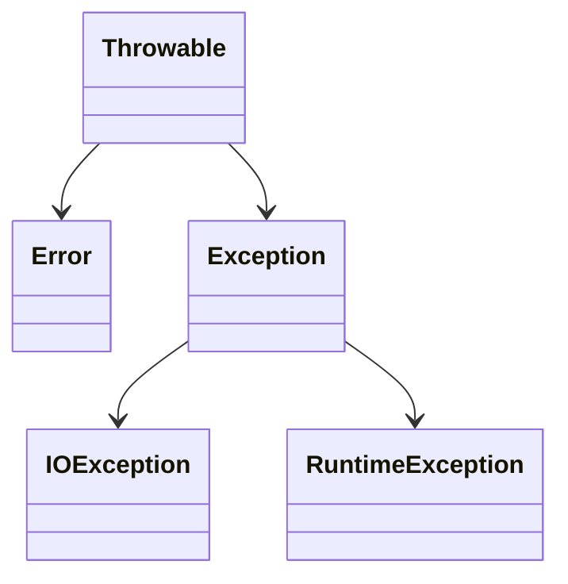

#### 异常

Java语言规范将`Error`和`IOException`类的异常定义为非检查型异常，其他异常定义为检查型异常。当调用某个可能抛出检查型异常的方法时，要么使用`try-catch`，要么在方法声明处加上`throws`。



###### `finally`子句

在`try-catch`语句后还可以加上`finally`子句，无论是否有捕获异常，`finally`中的代码都会被执行。

```java
public static void main(String[] args) {
    var arr = new int[1];
    try {
        System.out.println(arr[-1]);
    } catch (Exception ignored) {
        System.out.println("catch exception");
    } finally {
        System.out.println("do final work");
    }
}
// catch exception
// do final work
```

###### `try-with-resources`

对于实现了`AutoCloseable`接口的类，可以使用`try-with-resources`创建实例，其会在`try`语句块退出时自动调用`close()`。

还可以在`try`中指定已经定义了的实现`AutoCloseable`接口的类的示例，其也会在退出时自动调用`close()`。

```java
public class App {
    public static void main(String[] args) {
        try (Resource rsc = new Resource()) {
        } // close

        Resource rsc = new Resource();
        try (rsc) {
        } // close
    }

    static class Resource implements AutoCloseable {
        public void close() {
            System.out.println("close");
        }
    }
}
```

---

#### 断言

使用`assert`关键字添加断言，如果断言的结果为`false`，其将抛出`AssertError`异常。

断言有两种形式：

1. `assert condition;`。

2. `assert condition : expression;`。

   > `expression`将作为`AssertError`的参数。

###### 启用和禁止

默认情况下，断言是禁用的。在运行程序时，添加`-ea`选项以开启断言。

---

#### 日志

