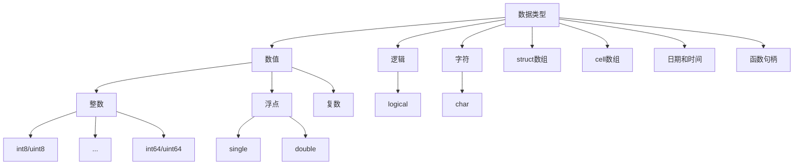

使用`class()`函数和获取表达式的简单类型，使用`whos()`函数获取变量的详细信息。

```matlab
class(0)            %% 'double'
class(int8(0))      %% 'int8'
```

Matlab中的变量默认视为矩阵，矩阵中的元素可以存放如下类型：



---

#### 数值

###### 复数

`z = a + bi`表示复数常量，使用`real()`计算实部，`imag()`计算虚部，`abs()`计算模。

```matlab
complex = 3 + 4i;
disp(real(complex));    %% 3
disp(imag(complex));    %% 4
disp(abs(complex));     %% 5
```

---

#### 字符和字符串

---

#### struct数组

struct数组是一种键值对组成的数据结构，有两种方式可以创建struct数组。

1. 直接赋值。

   ```matlab
   student.name = 'stu';
   student.age = 18;
   ```

2. 使用`struct()`函数。

   ```matlab
   student = struct('name','stu','age',18);
   ```

###### 删除字段

使用`rmfield()`删除某个字段，并返回删除字段后的新对象。可以传入字符串向量，一次删除多个字段。

```matlab
student.name = 'stu';
student.age = 18;
student = rmfield(student,["name","age"]);
disp(student);      %% 不包含字段的struct
```

---

#### cell数组

cell数组是可以存储不同数据类型单元的数组，有两种方式可以创建struct数组。

1. 使用`{}`运算符和`;`。

   ```matlab
   cell_1_6 = {1,2,3,4,5,6};   %% 1x6的cell数组
   cell_2_3 = {1,2,3;4,5,6};   %% 2x3的cell数组
   ```

2. 使用`cell()`函数。

   ```matlab
   cell(4);    %% 创建4x4的空cell数组
   cell(3,4);  %% 创建3x4的空cell数组
   ```

###### 访问cell数据

通过索引访问时，下标从1开始计数。

使用`()`获取cell数据集，使用`{}`获取数据具体内容。

```matlab
cell = {1,2,3;4,5,6};
disp(cell(2,2));        %% {[4]}
disp(cell{1,2});        %% 2
```

---

#### 时间和日期

###### 日期

`date()`获取当前日期。

`now()`获取当前的时间戳，`datestr()`将时间戳转换为字符串，精确到秒，

###### 计时

`tic()`开始计时，`toc()`获取从计时开始到现在过去的秒数。

---

#### 函数句柄

通过`@`操作符获取某个函数的句柄，通过其句柄可以对其进行某些操作。

如`func2str()`获取函数名，`functions()`获取函数的详细信息。

```matlab
disp(functions(@disp));
%% function: 'disp'
%%        type: 'simple'
%%        file: 'MATLAB built-in function'
```

